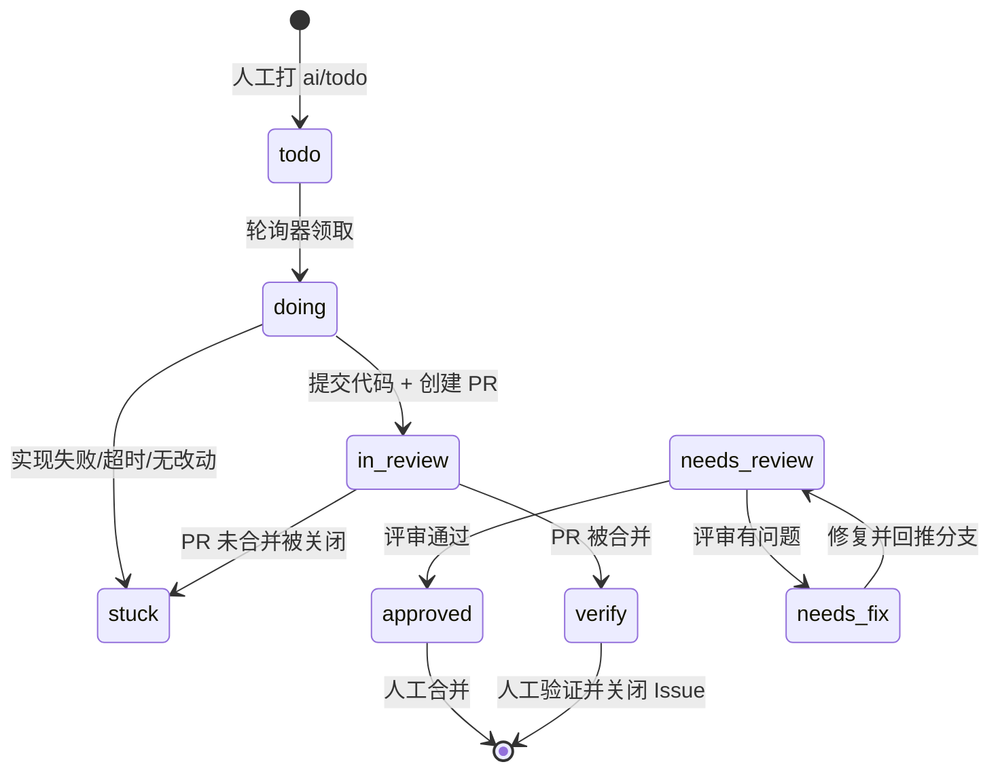

# AutoGit

把 `ai/*` 标签变成流水线的开关：给 Issue 打上 `ai/todo`，AutoGit 会自动领取任务、调用本机 **Codex CLI** 实现代码、创建 PR、评审、按评审意见修复，并在合并后把 Issue 交回人工验证。

支持 **GitHub**、**Gitea / Forgejo**、**Gitee** 三类代码托管平台，可同时配置多个账号与仓库。

---

## 目录

- [核心能力](#核心能力)
- [技术栈](#技术栈)
- [快速开始](#快速开始)
- [使用流程](#使用流程)
- [标签规范](#标签规范)
- [状态机](#状态机)
- [Codex CLI 集成](#codex-cli-集成)
- [HTTP API](#http-api)
- [数据与安全](#数据与安全)
- [常见问题](#常见问题)

---

## 核心能力

| 能力 | 说明 |
| --- | --- |
| 登录门禁 | 访问界面与所有接口都需要登录（唯一例外是只回运行状态、给监控用的 `GET /api/health`）；默认账号 `admin` / 密码 `admin`，支持「保持登录」自动登录与退出登录，登录后可在设置页改账号与密码；连续登录失败会临时限速 |
| 多平台账号 | GitHub / Gitea（含自建实例）/ Gitee，Token 本地加密存储，可随时测试连通性 |
| 仓库托管 | 按账号浏览仓库并导入，单独控制启用/暂停轮询 |
| 一键初始化标签 | 在目标仓库创建/校正全部 15 个 `ai/*` 标签（颜色、描述、单选语义） |
| Issue 自动实现 | `ai/todo` → 领取 → `ai/doing` → Codex 实现 → 分支推送 → 创建 PR → `ai/needs-review` |
| PR 自动评审 | 结构化评审结论（JSON Schema），通过 → `ai/approved`，有问题 → `ai/needs-fix` |
| 自动修复回路 | 按评审意见修复并回推分支，修复完成自动回到 `ai/needs-review` |
| 合并后处理 | 检测到 PR 合并 → Issue 转 `ai/verify`，等待人工验证关闭 |
| 阻塞与暂停 | 失败自动打 `ai/stuck` 并留言原因；`ai/paused` 人工暂停，轮询器跳过 |
| 优先级调度 | `ai/priority-high` 全局插队，`ai/priority-low` 后置，默认普通 |
| 引擎偏好 | `ai/prefer-codex` / `ai/prefer-claude`、`ai/review-codex` / `ai/review-claude` |
| 主题切换 | 界面右上角按钮在「跟随系统 / 浅色 / 深色」之间循环，选择保存在浏览器本地，默认跟随系统 |
| Codex CLI 管理 | 版本识别、能力探测、安装/自更新、config.toml 编辑与自动备份、模型响应探测 |
| 代理配置 | 全局 HTTP(S) 与 SOCKS5 两个通道，支持账号级单独代理，一键测试 GitHub API + `git ls-remote` 连通性 |
| 实时可观测 | WebSocket 推送任务状态与逐行日志（AI 输出、命令、Git、错误分流），可筛选与导出 |
| 任务编排 | 全局并发上限、单仓库并发上限、队列去重、超时与取消、失败重试 |

## 技术栈

选型目标是「一个人就能跑起来的本地工具」：单一语言、零外部服务、零原生编译依赖。

| 层 | 选择 | 理由 |
| --- | --- | --- |
| 包管理 | **pnpm workspaces** | 单仓多包，依赖严格隔离，安装快 |
| 语言 | **TypeScript**（全栈） | 前后端共享标签、状态机与类型定义 |
| 后端 | **Fastify 5** | 低开销、插件生态成熟，原生支持 WebSocket 与静态资源托管 |
| 数据库 | **SQLite（`node:sqlite`）** | Node 22.5+ 内置驱动，无需编译原生模块，单文件数据便于备份 |
| 前端 | **React 19 + Vite 8 + Tailwind CSS 4** | 构建极快，样式体系轻量，动效用 `motion` |
| 数据获取 | **TanStack Query 5** | 缓存/失效语义清晰，和 WebSocket 推送天然配合 |
| 校验 | **Zod 4** | 请求体校验 + 类型推导 |
| 代码质量 | **Biome 2** | 格式化 + Lint 一体化，速度快 |
| AI 引擎 | **Codex CLI（`codex exec`）** | 所有 AI 能力都通过本机 CLI 执行，AutoGit 不代理任何模型请求 |

> 说明：数据库驱动使用 Node 内置的 `node:sqlite`，因此要求 **Node ≥ 22.5**（推荐 24 LTS）。这也是整个项目没有任何原生编译依赖的原因。

## 快速开始

```bash
# 1. 安装依赖（Node ≥ 22.5，pnpm ≥ 10）
#    把 store 放在仓库外：本机默认的 store 就在项目目录里（<仓库>/.pnpm-store/v10，装完约 265 MB）
pnpm install --store-dir "$env:TEMP/pnpm-store"    # Windows PowerShell
pnpm install --store-dir /tmp/pnpm-store           # Linux / macOS

# 2. 开发模式：后端 4711，前端 5173（已配置代理 /api 与 WebSocket）
#    只有这条路径会放行 Vite 开发来源，其它本地端口一律拒绝
pnpm dev

# 或者生产模式：构建后由后端统一托管前端
pnpm build
pnpm start          # http://127.0.0.1:4711（编译产物自动按 NODE_ENV=production 运行）
```

`pnpm install` 默认会把包缓存（store）放在**项目目录**里：本机实测 `pnpm store path` 输出 `<仓库>/.pnpm-store/v10`，一次安装约 265 MB。它已被 `.gitignore` 挡住，但误提交过就要改写历史才能清掉，所以上面把 `--store-dir` 显式指到了仓库外；`pnpm repo:check` 在 store 落在仓库内时会打印一条 ⚠️ 警告（只警告、不影响退出码：落在哪里取决于机器上的 pnpm 配置，而不是仓库内容）。这里**没有**提交 `.npmrc` 固定 `store-dir`，原因是 AutoGit 跑任务的 Codex 沙箱只允许写任务工作区与临时目录（`apps/server/src/services/runner.ts` 用 `--sandbox workspace-write` 启动 Codex，设置页的「Codex 沙箱」是同一个开关），把 store 固定到用户主目录（`~/.pnpm-store`）会让沙箱里的 `pnpm install` 直接失败；机器级设置请写进 `~/.npmrc`，不要进仓库。

`pnpm start` 运行的是打包后的 `dist/index.js`，进程没有 `NODE_ENV` 时默认按生产模式启动：实时通道与写请求只接受同源与 `AUTOGIT_ALLOWED_ORIGINS` 列出的来源，服务日志也是结构化 JSON。手动 `node dist/index.js` 同理；需要从编译产物连 Vite 开发服务器（或想保留彩色的单行日志）时显式设置 `NODE_ENV=development`。

首次使用前，请确认 Codex CLI 可用：

```bash
codex --version        # 期望输出 codex-cli x.y.z
codex login            # 首次使用或凭证失效时执行一次设备授权
```

在网页的 **Codex CLI** 页面可以查看版本、能力探测结果与模型响应探测结果，也可以直接触发安装/更新、测试模型响应和编辑 `config.toml`。AutoGit 不读取也不代管凭证，只用一次最小的 `codex exec` 探针判断模型能否响应。

首次打开 http://127.0.0.1:4711 会跳转到登录页，默认账号与密码都是 `admin`：

- **保持登录**：勾选后凭证以 HttpOnly Cookie 保存在浏览器中，30 天内打开页面会自动登录（每次访问滚动续期，Cookie 的有效期同步顺延；页面长时间只挂着实时连接时，前端每 12 小时发一次会话查询让 Cookie 一起顺延）；不勾选则只在当前浏览器会话内有效（上限 12 小时，不滚动续期）。
- **修改账号密码**：登录后在「设置 → 登录与安全」中修改，需要验证当前密码；**确实改了**用户名或密码后，其他设备上的登录状态立即失效（包括已经建立的实时连接），本机保持登录 —— 发起这次修改的浏览器（含它的其它标签页）收到的是 `4402`「凭据已更新，用新会话重连」，前端只重连、不动登录态，所以改密码成功后不会闪一下登录页；只有修改请求本身失败（例如响应丢失）时，前端才会再用一次 `GET /api/auth/session` 确认会话，避免拿着已经被轮换掉的 Cookie 停在「看起来仍然登录」的状态。被吊销的其它页面会立刻退回登录页：实时连接收到服务端的 `4401` 关闭帧时广播一次「会话失效」并停止重连，受保护接口返回 `401`（含 `PUT /api/auth/credentials`）时同样广播，而不是停在一个看起来仍然登录的页面上。
- **空保存不会登出任何设备**：「有没有改动」按库里的凭据判定，而不是看请求带了哪些字段 —— 用户名与当前一致（含只差大小写，登录与会话校验本来就是大小写不敏感的）、密码留空或与当前密码相同，都属于「没有实际改动」。这时 `PUT /api/auth/credentials` 返回 `200` 与 `rotated: false`，`session` 就是调用方原来那个会话：不换 Cookie、不写 `auth_account`、不吊销任何会话（设置页按这个字段提示「未检测到改动」，而不是「已更新」）。只有真的改了才轮换。
- **退出登录**：左侧边栏底部或页面右上角的「退出登录」按钮会吊销当前会话并清除凭证。
- **登录失败限速**：连续失败 5 次后进入退避窗口，窗口内一律返回 `429` 与「请 N 秒后重试」，每次再失败窗口翻倍（最长 30 秒）；窗口会自动过期，成功登录立即清零，所以忘记密码不会把自己永久锁在外面。
- **忘记密码**：停掉服务后删除 `~/.autogit/data/autogit.sqlite` 中 `auth_account` 与 `auth_sessions` 两张表的数据（或参照 [docs/RESET.md](docs/RESET.md) 重置整个数据目录），下次启动会恢复默认的 `admin` / `admin`。

## 使用流程

1. **添加账号** — 进入「Git 账号」，选择平台并粘贴 Personal Access Token。GitHub 默认使用 `api.github.com`（企业版填 `https://git.example.com`，程序会自动补 `/api/v3`）；Gitea 填实例地址（自动补 `/api/v1`）；Gitee 使用 `https://gitee.com/api/v5`。
2. **导入仓库** — 在账号卡片里「浏览仓库」搜索并导入，或「仓库」页面手动填写 `owner/repo`。
3. **初始化标签** — 在仓库卡片或仓库工作台点击「初始化 / 同步标签」。该操作幂等：只创建缺失标签，颜色/描述不一致时更新，其它情况不动。
4. **启动流水线** — 在 Issue 上打 `ai/todo`，等待一个轮询周期（默认 45 秒），或在总览页点「立即轮询」。
5. **观察执行** — 「任务」页面可看到实现/评审/修复任务与逐行实时日志；仓库工作台显示 Issue/PR 看板。
6. **人工收尾** — PR 变成 `ai/approved` 后由人工合并（分支历史夹带过工作区产物时只能用 `Squash and merge` 或先改写历史，见[合并 PR 前](#合并-pr-前确认分支历史干净)）；合并后 Issue 转 `ai/verify`，验证完成手动关闭。

### 访问 GitHub 失败？先配置代理

如果本机直连 GitHub 不稳定（`git fetch` 报 `Failed to connect to github.com port 443`），在左侧 **代理配置** 页面：

1. 打开「启用代理」，确认「默认通道」为 HTTP(S) 代理（账号选择「继承全局默认」时用它）。
2. 在「代理服务器」的 **HTTP(S) 代理** 里填入本地代理地址（例如 Clash / v2ray 的混合端口 `http://127.0.0.1:7890`）——明文 http 走绝对地址转发，https 走 CONNECT 隧道；只填 **SOCKS5 代理**（如 `socks5h://127.0.0.1:1080`）也可以，留空的通道会自动回退到另一个。
3. 点「测试全部通道」：会分别测「直连」「HTTP(S) 代理」「SOCKS5 代理」，每项都包含一次 GitHub REST API 请求和一次真实的 `git ls-remote`，可以直接看出哪条链路可用。
4. 需要给某个账号换出口（例如自建 Gitea 直连、GitHub 走代理），在「账号代理」区域或账号编辑弹窗里单独指定。

代理会作用于该账号的 Issue/PR 读写、`git clone/fetch/push`，以及执行任务时 `codex exec` 子进程的 `HTTP(S)_PROXY`、`ALL_PROXY` 环境变量（模型请求同样受益）。地址以 AES-256-GCM 加密保存，页面与接口只回显掩码。

> 从早期版本升级：原来的「HTTP 代理 / HTTPS 代理」两个通道会自动合并为 HTTP(S) 通道（优先采用原 HTTPS 代理地址，它已验证过 CONNECT），账号上原来选「HTTPS 代理 / 按目标协议自动」的会落到 HTTP(S) 通道。

### 最小权限建议

| 平台 | 权限 |
| --- | --- |
| GitHub | `repo`（代码 + PR）、`issues`（Issue 与标签） |
| Gitea | `repository` 读写、`issue` 读写 |
| Gitee | `projects`、`pull_requests`、`issues`（私有仓库需勾选对应私有项目） |

## 标签规范

所有标签统一使用 `ai/` 前缀，共 15 个，由 AutoGit 在仓库中创建与维护。

| 标签 | 分组 | 语义 |
| --- | --- | --- |
| `ai/todo` | Issue 状态（单选） | 待 AI 实现；轮询领取后转 `ai/doing` |
| `ai/doing` | Issue 状态（单选） | AI 正在实现；开 PR 后转 `ai/in-review`，异常转 `ai/stuck` |
| `ai/in-review` | Issue 状态（单选） | 已关联 PR 并处于评审/修复；合并后转 `ai/verify` |
| `ai/verify` | Issue 状态（单选） | PR 已合并，待提出人/产品验证；通过后人工关闭 Issue |
| `ai/needs-review` | PR 状态（单选） | 待 AI 评审；通过转 `ai/approved`，有问题转 `ai/needs-fix` |
| `ai/needs-fix` | PR 状态（单选） | 待按评审意见修复；完成后转 `ai/needs-review` |
| `ai/approved` | PR 状态（单选） | AI 评审通过，待人工审核并决定是否合并 |
| `ai/stuck` | 异常状态 | 流水线暂停；处理后移除并打回一个适用状态标签 |
| `ai/paused` | 调度开关 | 人工暂停；保留当前状态但轮询器不执行 |
| `ai/prefer-codex` | 执行引擎（可选单选） | Codex 优先；限额时切 Claude；默认即此顺序 |
| `ai/prefer-claude` | 执行引擎（可选单选） | Claude 优先；限额时切 Codex |
| `ai/review-codex` | 评审引擎（可选单选） | Codex 评审优先；未设置时默认即此顺序 |
| `ai/review-claude` | 评审引擎（可选单选） | Claude 评审优先；未设置时 Codex 优先 |
| `ai/priority-high` | 调度优先级（可选单选） | 高；构建队列全局优先，评审队列内优先 |
| `ai/priority-low` | 调度优先级（可选单选） | 低；无标签为普通，构建/评审队列均后置 |

> 引擎说明：默认且唯一的完整实现是 **Codex CLI**。`ai/prefer-claude` / `ai/review-claude` 只有在「设置」中开启 Claude 回退且本机存在 `claude` 命令时才会生效，否则自动回退到 Codex。

## 状态机



约定：

- Issue 与 PR 各自维护一套「单选」状态标签，切换状态时旧状态标签会被移除。
- `ai/stuck` 与 `ai/paused` 是附加开关，不会覆盖已有状态，便于人工判断停在哪里。
- 只跟踪 **open** 的 Issue/PR：远端关闭 Issue（或 PR 被合并、关闭）后，条目会在下一次轮询时离开看板、计数与调度队列；本地快照保留，用于任务历史与标签回溯。
- 修复与评审共用 PR 分支；分支名固定为 `<branchPrefix><issueNumber>-<slug>`（默认 `ai/issue-`），AutoGit 只会强推自己的分支。

## Codex CLI 集成

| 功能 | 实现 |
| --- | --- |
| 版本识别 | 执行 `codex --version`，从 `codex-cli x.y.z` 中解析版本号 |
| 能力探测 | 解析 `codex exec --help` 与 `codex --help`，只在支持时追加 `--json`、`--sandbox`、`--cd`、`--output-last-message`、`--output-schema`、`-c` 等参数 |
| 安装 / 更新 | 已安装且支持 `codex update` 时执行自更新，否则回退到 `npm install -g @openai/codex@latest`；输出实时推送前端 |
| 模型响应 | 用固定提示词执行一次最小的 `codex exec`（只读沙箱、AutoGit 数据目录内运行），按退出码与输出判断模型能否响应；结果缓存 5 分钟，同一时刻只跑一次探测，凭证始终由 Codex CLI 自己管理。`POST /api/codex/invalidate`（页面上的「重新检测」）只清缓存并在后台触发探测，请求立即返回，状态接口用 `probing` 字段跟进；「测试模型响应」按钮才会等待探测结果 |
| 配置管理 | 直接编辑 `$CODEX_HOME/config.toml`，保存前做 TOML 校验，自动备份并保留最近 10 份 |
| 执行方式 | `codex exec --json -` 从 stdin 读取提示词；评审任务额外使用 `--output-schema` 强制结构化结论 |
| 隔离 | 每个仓库一个工作区（`~/.autogit/workspaces/<repoId>`），任务级目录存放提示词、JSON Schema 与最后一条消息 |

任务提示词可在仓库工作台点击「提示词预览」查看，不会触发真实执行。

## HTTP API

所有接口都在 `/api` 下，返回 JSON；实时事件走 WebSocket `/api/realtime`。除 `POST /api/auth/login`、`GET /api/auth/session`、`POST /api/auth/logout` 与探活用的 `GET /api/health`（只回 `ok` / `uptimeSeconds` / `version` / `node`，供 systemd、容器 healthcheck 与外部监控使用）外，**所有接口都需要有效的登录会话 Cookie**，否则返回 `401`。写请求（非 `GET`/`HEAD`/`OPTIONS` 的方法）还要通过来源校验，见下一段。

门禁按路由匹配结果判断而不是原始 URL：`/%61pi/system/overview` 这类百分号编码写法与 `/api/system/overview` 命中同一条路由，同样会被拦下（实时通道的升级请求也一样）。

实时通道的升级请求与非 `GET`/`HEAD`/`OPTIONS` 的 `/api` 写请求都要求 `Origin` 与请求到达的 `Host` 一致（比较的是主机与端口：TLS 通常终结在反向代理上，此时进程看到的协议是 `http`，把协议拉进这条比较会锁住所有 HTTPS 部署），开发模式额外放行 Vite 开发服务器的来源（默认 `http://localhost:5173`、`http://127.0.0.1:5173`），不一致直接 `403`，不再只依赖「浏览器会不会带上 `SameSite=Lax` 的 Cookie」。升级请求拿不到可读的响应、也没有 CORS 层兜底，所以只能自己比对；写请求同理：`POST /api/orchestrator/tick`、`POST /api/orchestrator/restart`、`POST /api/codex/invalidate` 这类请求没有请求体，属浏览器眼里的简单请求，**不触发预检**，同站另一个端口（`127.0.0.1:9999`、被顶掉的本地服务）照样把 Cookie 带过来 —— 读响应被 CORS 挡住，但动作已经发生。发不出 `Origin` 的调用方（`curl`、探针、脚本）不受影响：浏览器一定会带这个头，页面脚本也改不了它。`AUTOGIT_ALLOWED_ORIGINS` / `AUTOGIT_DEV_ORIGINS` 里的条目按完整 origin 比较：写了协议就锁定协议（列了 `https://autogit.example.com` 就不会再放行 `http://autogit.example.com`），只写主机名的老写法保持「只比主机」的语义；反向代理改写了 `Host`、或开发前端跑在另一台机器上时，用 `AUTOGIT_ALLOWED_ORIGINS` 追加允许的来源。

反向代理终结 TLS 时还要给进程设 `AUTOGIT_TRUST_PROXY=1`（或只信任代理地址的 `AUTOGIT_TRUST_PROXY=127.0.0.1,::1`）：Fastify 才会采信 `X-Forwarded-Proto`，登录 / 续期 / 退出登录下发的会话 Cookie 才会带 `Secure`。不设置时这个头一律忽略，直连端口的客户端无法用它影响 Cookie 属性（细节见「数据与安全」）。

| 分类 | 方法与路径 |
| --- | --- |
| 登录 | `POST /api/auth/login`、`GET /api/auth/session`、`POST /api/auth/logout`、`PUT /api/auth/credentials` |
| 系统 | `GET /api/health`、`GET /api/system/overview`、`GET /api/system/activity`、`GET /api/system/labels` |
| 调度 | `GET /api/orchestrator`、`POST /api/orchestrator/tick`、`POST /api/orchestrator/restart` |
| 账号 | `GET/POST /api/accounts`、`PATCH/DELETE /api/accounts/:id`、`POST /api/accounts/:id/test`、`GET /api/accounts/:id/repositories` |
| 仓库 | `GET/POST /api/repositories`、`PATCH/DELETE /api/repositories/:id`、`GET /api/repositories/:id/overview` |
| 标签 | `GET /api/repositories/:id/labels/preview`、`POST /api/repositories/:id/labels/initialize` |
| 任务 | `POST /api/repositories/:id/sync`、`POST /api/repositories/:id/tasks`、`GET /api/tasks`、`GET /api/tasks/:id`、`POST /api/tasks/:id/cancel`、`POST /api/tasks/:id/retry` |
| Codex | `GET /api/codex/status`、`POST /api/codex/install`、`POST /api/codex/invalidate`、`POST /api/codex/probe`、`GET/PUT /api/codex/config`、`GET /api/codex/prompt-preview` |
| 代理 | `GET/PUT /api/proxy`、`POST /api/proxy/test` |
| 设置 | `GET/PUT /api/settings` |

## 数据与安全

- **数据目录**：`~/.autogit`（可用 `AUTOGIT_HOME` 覆盖），包含 `data/autogit.sqlite`、`workspaces/`、`secret.key`、`logs/`。
- **登录凭证**：账号只有一份，密码以 scrypt 哈希存放在 `auth_account` 表，明文不落库；登录会话的随机 token 只保存 SHA-256 摘要（`auth_sessions`），浏览器侧是 HttpOnly + SameSite=Lax 的 Cookie，脚本读不到。首次启动自动创建默认账号 `admin` / `admin`，接口只返回用户名与「密码是否仍是出厂口令」的提示，不返回任何哈希；这个提示只跟密码走，所以「先把用户名改掉、密码还留着」的账号一样会持续提醒。每次登录恒定执行一次 scrypt（用户名不存在时校验进程内生成好的诱饵哈希），所以「用户名不存在」与「密码错误」的响应时间与文案都一致，无法用来枚举账号；连续失败 5 次后进入 1 秒起步、逐次翻倍、最长 30 秒的退避窗口，把在线猜解压到每秒一次量级，成功登录即清零。
- **跨源访问**：服务端不设置任何 CORS 响应头，别的网站在浏览器里读不到本机接口的响应（开发模式走 Vite 同源代理，生产模式由后端直接托管前端，都不需要跨源）；实时通道的 WebSocket 升级与非 `GET`/`HEAD`/`OPTIONS` 的写请求再单独校验 `Origin` 与 `Host` 同源（只比主机与端口，理由见「HTTP API」），不一致直接 `403` —— 公开接口也不例外，跨站的 `POST /api/auth/login` 会被拒，免得别的页面把浏览器登录到攻击者掌握的账号上。生产模式（`NODE_ENV=production`，`pnpm start` 默认如此）只接受同源与 `AUTOGIT_ALLOWED_ORIGINS`；开发模式额外接受 `AUTOGIT_DEV_ORIGINS`（默认 `http://localhost:5173`、`http://127.0.0.1:5173`），不再放行「任意回环来源」——本机其它端口的页面对于 `127.0.0.1` 属于同站，Lax Cookie 会随请求（含 WebSocket 握手）发出，旧实现等于让它们也能订阅任务日志、也能直接触发轮询与重启。白名单条目按完整 origin 比较（协议 + 主机 + 端口，统一小写）：列了 `https://autogit.example.com` 就不会再放行同主机的 `http://autogit.example.com`，只写主机名的条目保持「只比主机」的旧语义。会话失效时（退出登录、改凭据、过期）会立刻关闭该会话已建立的实时连接。
- **反向代理与 `Secure` Cookie**：TLS 终结在反向代理、以明文 HTTP 转发给 AutoGit 时（`AUTOGIT_ALLOWED_ORIGINS` 描述的正是这种部署），进程看到的协议是 `http`，默认（`AUTOGIT_TRUST_PROXY` 未设置）下会话 Cookie 不会带 `Secure`——这条加固只在 HTTPS 部署里有意义，而默认直连的用法（`127.0.0.1`）不受影响。要补上它，给反向代理设 `AUTOGIT_TRUST_PROXY=1`（`true` / `yes` / `on` 等价）：Fastify 随即采信 `X-Forwarded-Proto`，`request.protocol` 返回 `https`，登录、滚动续期与退出登录的 Cookie 都会带 `Secure`。若后端端口不止代理能访问，用地址列表形式（`AUTOGIT_TRUST_PROXY=127.0.0.1,::1`）只信任那些代理；选项关闭时该请求头一律忽略，任何能直连端口的调用方都无法用 `X-Forwarded-Proto: https` 影响 Cookie 属性。
- **Token 加密**：使用 AES-256-GCM 加密后落库，密钥来自 `AUTOGIT_SECRET_KEY` 或自动生成的 `secret.key`；接口返回的只是掩码预览。
- **Git 认证**：推送/拉取通过 `GIT_CONFIG_*` 环境变量注入 `http.extraheader`，Token 不会写进 `.git/config`，也不会出现在命令行参数里。
- **代理地址**：HTTP(S) 与 SOCKS5 两个通道和账号级代理同样加密落库，接口只返回掩码；仅在配置了代理时注入 `http.proxy` 与代理环境变量，并清空凭据助手避免 Git Credential Manager 探测代理主机。
- **分支保护**：只有以 `branchPrefix`（默认 `ai/`）开头的分支才会被强推，人工分支永远不会被覆盖。
- **执行边界**：所有代码改动都发生在独立克隆的工作区，不会碰你的本地开发目录；沙箱与审批策略由 Codex 配置控制（默认 `workspace-write` + `never`）。
- **不自动合并**：评审通过只打 `ai/approved`，合并动作始终留给人工；分支历史里夹带过 `.pnpm-store` 这类产物时，合并方式只能是 `Squash and merge` 或先改写历史（见[合并 PR 前](#合并-pr-前确认分支历史干净)）。
- **可重置**：全部状态都在 `~/.autogit` 一个目录里，清除与迁移步骤见 [docs/RESET.md](docs/RESET.md)。

环境变量见 [.env.example](.env.example)。常用项：

```bash
AUTOGIT_PORT=4711
AUTOGIT_POLL_SECONDS=45
AUTOGIT_MAX_CONCURRENT=2
AUTOGIT_MAX_CONCURRENT_PER_REPO=1
# AUTOGIT_ALLOWED_ORIGINS=https://autogit.example.com
# AUTOGIT_DEV_ORIGINS=http://localhost:5174   # 仅开发模式生效（Vite 换端口时用）
# AUTOGIT_TRUST_PROXY=1                       # 反向代理终结 TLS 时设置，Cookie 才会带 Secure
# AUTOGIT_CODEX_PATH=C:\Users\me\AppData\Roaming\npm\codex.cmd
```

## 验证

```bash
pnpm typecheck    # 三个包全量类型检查
pnpm check        # Biome lint + 格式校验
pnpm repo:check   # 仓库历史里没有 .pnpm-store（合并前必跑；先自检扫描逻辑，再扫 HEAD 可达对象）
pnpm build        # shared → server → web
pnpm simulate     # 端到端模拟：真实 git + 假 Codex + 假 Git 平台
pnpm --filter @autogit/server auth:check            # 登录门禁自检（临时数据目录，真实 HTTP 路由）
pnpm --filter @autogit/web client:check            # 前端会话生命周期自检（4401 登出 / 4402 轮换重连 / 401 的登录态广播 / 会话结束后的清理）
pnpm --filter @autogit/server proxy:check          # 代理链路自检（本地起 HTTP/SOCKS5 代理）
pnpm --filter @autogit/server proxy:check -- --online  # 额外验证真实 HTTPS 隧道
```

`pnpm simulate` 会在临时目录中创建裸仓库，跑完整链路（初始化 15 个标签 → 实现 → 建 PR → 评审不通过 → 修复 → 复审通过 → 合并 → `ai/verify`），断言每一步的标签与产物；随后再经真实 HTTP 路由回归三处边界：失败后重试门禁立即放行、`POST /api/codex/invalidate` 不内联等待模型探测、`POST /api/orchestrator/restart` 不误伤在途任务。最后自动清理。

`proxy:check` 会启动一次性本地代理并断言 11 项行为（绝对形式转发、CONNECT 隧道、SOCKS5 用户名密码、认证失败提示、远程 DNS、重定向、gzip、错误码映射等），`--online` 会再追加两项真实 `https://api.github.com/` 隧道检查。

`auth:check` 会在临时 `AUTOGIT_HOME` 中启动真实 HTTP 栈并断言 45 项行为：未登录访问接口与实时通道返回 401（`OPTIONS` 与预检样式请求同样需要会话）、探活接口 `GET /api/health`（含编码写法）未登录可访问且只回运行状态、百分号编码路径（`/%61pi/...`，含 `OPTIONS`）同样被拦下、默认账号可登录、用户名不存在与密码错误在响应时间与文案上不可区分、勾选/不勾选「保持登录」的 Cookie 差异与滚动续期（续期时同步续期浏览器 Cookie，并核对库内 `expires_at` 前移的幅度与 Cookie `Max-Age` 一致；非保持登录保持 12 小时上限）、跨源请求不返回 CORS 头、写请求的来源校验（跨站与同站其它端口的 `POST /api/orchestrator/tick`、`POST /api/orchestrator/restart`、`POST /api/codex/invalidate` 全部 403，跨站 `POST /api/auth/login` 同样 403，未登录的跨站写请求仍是 401，同源 / Vite 开发来源 / 无 `Origin` 的写请求 200）、会话摘要不再同步跑 scrypt、过期会话被清理、修改账号密码的校验与会话轮换、只改用户名时仍提示「仍在使用默认密码」、把密码显式改回出厂值后提示恢复（`password_changed_at` 被清空）、旧密码失效、其他设备会话被吊销、没有实际改动的保存（用户名与当前一致、密码留空）返回 `rotated: false` 且不换 Cookie、不写 `auth_account`、不吊销其他设备的会话、把当前密码原样填回来与用户名只改大小写同样不算改动、退出登录清除凭据、连续登录失败触发 `429` 且窗口过期后自动恢复并清零、编译产物（`pnpm start`）默认按生产模式启动且显式 `NODE_ENV` 优先、`AUTOGIT_DEV_ORIGINS` 只在开发模式生效、真实 WebSocket 升级路径（未登录 401、跨站 `Origin` 403、同源与 Vite 开发来源 101、其它本地端口与生产模式的开发来源 403、生产模式只放行显式允许列表、白名单与开发来源的协议必须一致（`https://` 条目不放行 `http://` 来源，反之亦然）、只写主机名的条目仍按主机比对、改凭据时发起这次请求的浏览器收到 4402（重连）、其它设备与退出登录后的连接被 4401 关闭）、`AUTOGIT_TRUST_PROXY` 的解析（默认关闭、开 / 关写法、地址列表）与反向代理下的 `Secure` Cookie（登录、滚动续期、退出登录清除三处都带，代理报告明文时不带；开关关闭时 `X-Forwarded-Proto` 一律忽略），以及旧库升级时 `password_changed_at` 的回填，最后自动清理。

`client:check` 用 `window` / `WebSocket` / `fetch` 三个桩件跑前端会话生命周期的 10 项断言：实时连接收到 `4401`（其他设备改凭据、退出登录、会话过期）时广播一次 `autogit:unauthorized` 并停止重连；收到 `4402`（本机改凭据，新 Cookie 就在同一个响应里）时不广播、只退避重连，登录态原地不动（否则改密码成功会先闪一下登录页）；其它关闭码先按 5 分钟节流核对一次会话（会话已失效同样广播）再退避重连，会话仍有效时不广播；受保护接口（含 `PUT /api/auth/credentials`）返回 `401` 时广播失效，而公开的登录 / 会话查询 / 退出登录接口返回 `401`（密码错误）与其它状态码（如 `403`）不广播。会话结束后的清理用真的 React Query 缓存验证（`window` 桩件带事件总线，广播会真的送到订阅方）：`4401` 与登出都走 `lib/session-state.ts` 的 `resetSessionState`，任务日志缓冲清空、受保护查询缓存移除、缓存里的登录态回到匿名；最后再核对 `AuthProvider` 编译后的源码确实把会话失效广播与 `logout` 都接到这个入口，防止它退回没人调用的死代码。

### PR 标题与正文规范

PR 标题由 `renderTitle()` 渲染「设置 → PR 标题模板」再归一化，结果必须满足仓库约定 `<英文类型>: <描述>`：类型取 `feat` / `fix` / `chore` / `refactor` / `docs` / `build` / `perf` / `test` / `ci` / `style` / `revert` 之一，冒号必须是半角且后面只有一个空格。

- 模板里已经写了英文类型（`fix: {issueTitle}`）时只做归一化：大小写转小写、全角冒号 `：` 换成半角 `:`、多余空格压成一个；
- 没写类型时按标题开头推断：`新增…` / `实现…` → `feat:`，`修复…` → `fix:`，`优化…` → `perf:`，`文档…` → `docs:`，`构建…` / `升级…` → `build:`，`回滚…` → `revert:`，其余落到 `feat:`；中文类型前缀（`修复：…`）同样被改写成英文；
- 模板渲染成空串时回落到 `<Issue 标题> (#<编号>)` 再补类型。

所以默认模板 `{issueTitle} (#{issueNumber})` 渲染出的「新增登录密码 (#4)」会被写成 `feat: 新增登录密码 (#4)`；提交信息遵守同一条约定（实现提交固定为 `feat: 实现 #<编号> <标题>`）。PR 正文由 `buildPullRequestBody()` 生成，固定包含且各出现一次 `## 实现假设清单` 与 `## 代码逻辑图` 两节、都非空；人工开 PR 时用仓库里的 `.github/pull_request_template.md` 起步。

### 合并 PR 前：确认分支历史干净

AutoGit 只强推 `ai/*` 分支，但分支历史里可能夹带工作区产物——例如一次误提交的 `.pnpm-store/`（`ai/issue-4-新增登录密码` 这条分支带着 11,678 个对象、约 265 MB，最大单个对象约 72 MB；`git rev-list --objects HEAD -- .pnpm-store` 的原始输出是 11,682 行 = 11,282 个 blob + 398 个 tree + 2 个提交，脚本按路径过滤掉那 2 个提交和 2 条没有路径的 tree，所以两处数字差 4）。工作树里删掉它并不够：这些对象仍从 `HEAD` 可达，所以**含这类历史的分支只能用 `Squash and merge`，或先改写历史再合并**。`Create a merge commit` 会把整条对象链并进 `main`，`Rebase and merge` 会重放当初添加这些文件的提交，两者都让这份包缓存永久留在 `main` 的祖先链里，之后只能靠改写 `main` 的历史才能消除（克隆体积、`git rev-list --objects`、`git log --all` 都会一直背着它）。合并前跑一次：

```bash
pnpm repo:check                    # 先在一个临时仓库里自检扫描逻辑，再扫 HEAD 可达的全部对象
pnpm repo:check --ref origin/main  # 合并后复核目标分支同样干净
pnpm repo:purge                    # 预演：列出会被改写的对象数量与备份位置（加 --apply 才真正改写）
pnpm repo:purge --base origin/main # 指定合并基准分支（默认按 origin/main、main、origin/master、master、origin/HEAD 探测）
```

`pnpm repo:check` 还会报告 pnpm store 的落点：落在仓库内时打印一条 ⚠️ 警告（只警告、不改退出码），并给出把 store 指向仓库外的安装命令，理由见上面「快速开始」里的安装说明。

命中 `.pnpm-store` 时会打印对象数量与体积、给出合并方式提醒，并以退出码 1 结束；先按下面二选一处理、再合并：

1. **改写历史**（有远端写权限时首选）：先 `git fetch origin`，再 `pnpm repo:purge` 预演（只读，不动任何引用），确认对象数量后 `pnpm repo:purge --apply`。脚本用 git 自带的 `filter-branch` 只改写**这条分支自己带来的提交**（`<合并基准>..<分支>`），基准分支的历史一字不动，所以 `main` 上 GitHub 建的合并提交（带 `gpgsig`，被重建就会丢签名、SHA 随之改变）不会被卷进来：范围一旦放宽到整条历史，`main` 的提交会在分支里被重建，与 `main` 的合并基准会从分叉点往后退（本仓库实测 `403990a` → `9daccf9`），PR 从「无冲突、合并结果树就是 `HEAD` 树」变成 8 个冲突文件——而 tip 树一个字没变，只看树根本发现不了。改写前先在临时仓库里跑一遍自检（几秒，`--skip-self-test` 跳过），改写时先在临时分支上做，比对 tip 树一字未变**且与基准分支的合并基准没有移动**才移动真正的分支，旧历史留在 `refs/autogit-backup/<分支>/<时间戳>`（`git update-ref refs/heads/<分支> <备份引用>` 即可回退）。基准默认按 `origin/main`、`main`、`origin/master`、`master`、`origin/HEAD` 的顺序探测，也可以用 `--base <ref>` 指定；对象是基准分支自己带进来的（本分支没添加过）时脚本会拒绝改写并说明原因。改写完推送并复核：`git fetch origin && git push --force-with-lease origin <分支>`，再跑 `pnpm repo:check` 确认本地可达历史归零。注意 `git filter-repo --path .pnpm-store --invert-paths` 并不等价：它默认改写它看到的所有 ref（包括 `main`），范围比这里大得多。
2. **Squash and merge**：GitHub 的合并按钮选 `Squash and merge`（只取 PR 的最终树），**不要**选 `Create a merge commit` 或 `Rebase and merge`；合并后删除该分支（`refs/pull/<n>` 仍会短暂保留这些对象，之后随 GC 回收）。

**本次收口决策（PR #8，`ai/issue-4-新增登录密码`）**：合并侧走第 2 条 —— 用 `Squash and merge` 合并并删除分支；若希望保留这条分支的逐个提交，必须先在有写权限的环境执行第 1 条（`pnpm repo:purge --apply` 后 `git push --force-with-lease`），确认 `pnpm repo:check` 归零，再改用普通合并。修复代理只改工作树里的源码、不重写历史（沙箱里 `.git` 只读，也没有推送权限），所以这条决策只能落在合并侧：仓库自身无法把已经提交过的对象从 `HEAD` 可达集合里摘掉。在这条分支上 `pnpm repo:check` 仍会以退出码 1 结束，这是预期结果（它扫的就是 `HEAD` 可达对象），`pnpm repo:check --ref origin/main` 保持退出码 0；只有走完上面第 1 条（改写历史）本地才会归零。第 1 条已在临时克隆上实测（改完立即复核）：改写只动这条分支自己带来的提交，tip 树逐字节不变、与 `origin/main` 的合并基准仍是 `403990a`、`git merge-tree --write-tree HEAD origin/main` 仍是退出码 0 且结果树等于 tip 树、`pnpm repo:check` 归零（改写前后 `main` 的提交逐字节相同）。涉及具体哈希的数字会随分支增长变化，以脚本每次打印的结果为准。标题同样按仓库规范收口：这个 PR 的标题应当是 `feat: 新增登录密码`（AutoGit 用当时的默认模板 `{issueTitle} (#{issueNumber})` 建成了「新增登录密码 (#4)」）；仓库里的改动只影响之后新建的 PR，所以这条也要由合并侧在 GitHub 上改。

「评审通过只打 `ai/approved`、合并动作留给人工」的约定不变，人工额外要确认的就是这里的合并方式。AutoGit 的修复代理跑在 `.git` 只读、也没有远端写权限的沙箱里，所以第 1 条只能由有推送权限的一侧执行；两条路都没走就合并，等于把这份包缓存写进 `main` 的祖先链。

## 常见问题

**轮询没有反应？**
确认仓库「轮询已启用」、Issue 是 open 状态且带有 `ai/todo`，并且没有 `ai/paused` / `ai/stuck`。可在总览页点「立即轮询」手动触发一次，任务页会显示日志。

**忘记登录密码了？**
登录凭证存放在 `~/.autogit/data/autogit.sqlite` 的 `auth_account` 表中，删除该表（以及 `auth_sessions`）的数据后重启服务即恢复默认的 `admin` / `admin`；也可以在临时目录里用 `sqlite3` 或 Node 的 `node:sqlite` 执行 `DELETE FROM auth_account; DELETE FROM auth_sessions;`。这一步只影响登录账号，不会清空仓库、任务与代理配置。

**任务失败并打上 `ai/stuck`？**
任务日志（任务页 → 选中任务）会显示 Codex 的输出与错误。常见原因是模型响应探测未通过（凭证失效、模型权限不足）、Issue 描述信息不够。可先在 Codex CLI 页面点「测试模型响应」确认模型能回答，再移除 `ai/stuck`，打回 `ai/todo` 或 `ai/needs-review` 继续。

**自动标签初始化一直失败？**
检查 Token 是否具备仓库的 `issues`/`labels` 管理权限；自建 Gitea 请确认实例地址能被本机访问，并且版本 >= 1.20。

**Gitee 上 PR 标签没有生效？**
不同 Gitee 版本对标签接口的支持略有差异，AutoGit 会依次尝试 `PUT /pulls/{n}/labels`、`PUT /issues/{n}/labels` 等端点；若仍失败，任务日志会保留原始 HTTP 错误，便于定位。

**能改成用 Claude 吗？**
可以，但需要本机安装 `claude` 命令，并在「设置」中开启 Claude 回退；带 `ai/prefer-claude` / `ai/review-claude` 的条目会优先使用它。默认全部走 Codex CLI。

**配了代理还是连不上 GitHub？**
先看「代理配置」页的测试结果：`git ls-remote` 失败一般说明代理本身拒绝 CONNECT 或需要认证（把地址写成 `http://用户名:密码@主机:端口`）；如果代理通道都不通而直连可用，把「默认通道」改成「直连」或给该账号单独指定直连。也可以在仓库里跑 `pnpm --filter @autogit/server proxy:check` 自检代理客户端（加 `-- --online` 会额外验证真实 HTTPS 隧道）。

---

架构与实现细节见 [docs/ARCHITECTURE.md](docs/ARCHITECTURE.md)，平台差异见 [docs/PROVIDERS.md](docs/PROVIDERS.md)，清除配置与数据见 [docs/RESET.md](docs/RESET.md)。
