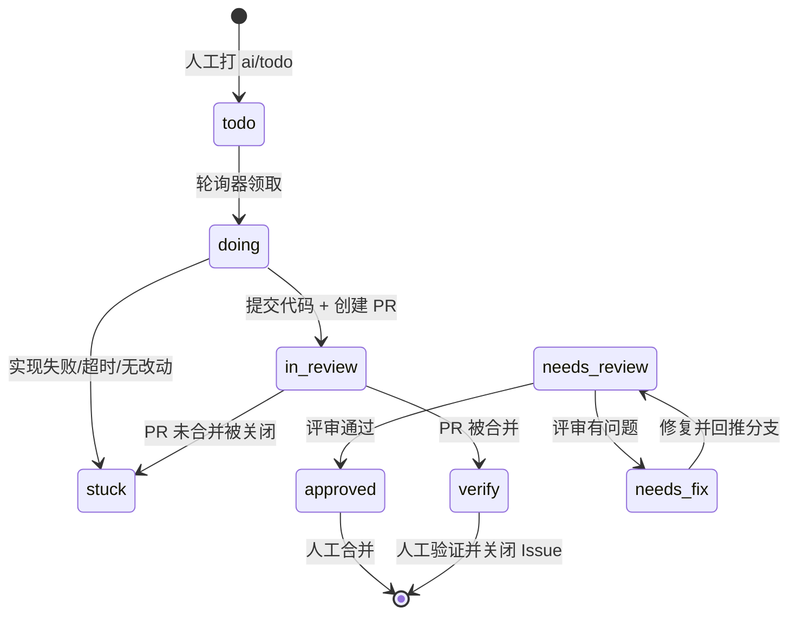

# AutoGit

把 `ai/*` 标签变成流水线的开关：给 Issue 打上 `ai/todo`，AutoGit 会自动领取任务、调用本机 **Codex CLI** 实现代码、创建 PR、评审、按评审意见修复，并在合并后把 Issue 交回人工验证。

支持 **GitHub**、**Gitea / Forgejo**、**Gitee** 三类代码托管平台，可同时配置多个账号与仓库。

---

## 目录

- [核心能力](#核心能力)
- [技术栈](#技术栈)
- [快速开始](#快速开始)
- [使用流程](#使用流程)
- [标签规范](#标签规范)
- [状态机](#状态机)
- [Codex CLI 集成](#codex-cli-集成)
- [HTTP API](#http-api)
- [数据与安全](#数据与安全)
- [常见问题](#常见问题)

---

## 核心能力

| 能力 | 说明 |
| --- | --- |
| 登录门禁 | 访问界面与所有接口都需要登录；默认账号 `admin` / 密码 `admin`，支持「保持登录」自动登录与退出登录，登录后可在设置页改账号与密码；连续登录失败会临时限速 |
| 多平台账号 | GitHub / Gitea（含自建实例）/ Gitee，Token 本地加密存储，可随时测试连通性 |
| 仓库托管 | 按账号浏览仓库并导入，单独控制启用/暂停轮询 |
| 一键初始化标签 | 在目标仓库创建/校正全部 15 个 `ai/*` 标签（颜色、描述、单选语义） |
| Issue 自动实现 | `ai/todo` → 领取 → `ai/doing` → Codex 实现 → 分支推送 → 创建 PR → `ai/needs-review` |
| PR 自动评审 | 结构化评审结论（JSON Schema），通过 → `ai/approved`，有问题 → `ai/needs-fix` |
| 自动修复回路 | 按评审意见修复并回推分支，修复完成自动回到 `ai/needs-review` |
| 合并后处理 | 检测到 PR 合并 → Issue 转 `ai/verify`，等待人工验证关闭 |
| 阻塞与暂停 | 失败自动打 `ai/stuck` 并留言原因；`ai/paused` 人工暂停，轮询器跳过 |
| 优先级调度 | `ai/priority-high` 全局插队，`ai/priority-low` 后置，默认普通 |
| 引擎偏好 | `ai/prefer-codex` / `ai/prefer-claude`、`ai/review-codex` / `ai/review-claude` |
| 主题切换 | 界面右上角按钮在「跟随系统 / 浅色 / 深色」之间循环，选择保存在浏览器本地，默认跟随系统 |
| Codex CLI 管理 | 版本识别、能力探测、安装/自更新、config.toml 编辑与自动备份、模型响应探测 |
| 代理配置 | 全局 HTTP(S) 与 SOCKS5 两个通道，支持账号级单独代理，一键测试 GitHub API + `git ls-remote` 连通性 |
| 实时可观测 | WebSocket 推送任务状态与逐行日志（AI 输出、命令、Git、错误分流），可筛选与导出 |
| 任务编排 | 全局并发上限、单仓库并发上限、队列去重、超时与取消、失败重试 |

## 技术栈

选型目标是「一个人就能跑起来的本地工具」：单一语言、零外部服务、零原生编译依赖。

| 层 | 选择 | 理由 |
| --- | --- | --- |
| 包管理 | **pnpm workspaces** | 单仓多包，依赖严格隔离，安装快 |
| 语言 | **TypeScript**（全栈） | 前后端共享标签、状态机与类型定义 |
| 后端 | **Fastify 5** | 低开销、插件生态成熟，原生支持 WebSocket 与静态资源托管 |
| 数据库 | **SQLite（`node:sqlite`）** | Node 22.5+ 内置驱动，无需编译原生模块，单文件数据便于备份 |
| 前端 | **React 19 + Vite 8 + Tailwind CSS 4** | 构建极快，样式体系轻量，动效用 `motion` |
| 数据获取 | **TanStack Query 5** | 缓存/失效语义清晰，和 WebSocket 推送天然配合 |
| 校验 | **Zod 4** | 请求体校验 + 类型推导 |
| 代码质量 | **Biome 2** | 格式化 + Lint 一体化，速度快 |
| AI 引擎 | **Codex CLI（`codex exec`）** | 所有 AI 能力都通过本机 CLI 执行，AutoGit 不代理任何模型请求 |

> 说明：数据库驱动使用 Node 内置的 `node:sqlite`，因此要求 **Node ≥ 22.5**（推荐 24 LTS）。这也是整个项目没有任何原生编译依赖的原因。

## 快速开始

```bash
# 1. 安装依赖（Node ≥ 22.5，pnpm ≥ 10）
pnpm install

# 2. 开发模式：后端 4711，前端 5173（已配置代理 /api 与 WebSocket）
pnpm dev

# 或者生产模式：构建后由后端统一托管前端
pnpm build
pnpm start          # http://127.0.0.1:4711
```

首次使用前，请确认 Codex CLI 可用：

```bash
codex --version        # 期望输出 codex-cli x.y.z
codex login            # 首次使用或凭证失效时执行一次设备授权
```

在网页的 **Codex CLI** 页面可以查看版本、能力探测结果与模型响应探测结果，也可以直接触发安装/更新、测试模型响应和编辑 `config.toml`。AutoGit 不读取也不代管凭证，只用一次最小的 `codex exec` 探针判断模型能否响应。

首次打开 http://127.0.0.1:4711 会跳转到登录页，默认账号与密码都是 `admin`：

- **保持登录**：勾选后凭证以 HttpOnly Cookie 保存在浏览器中，30 天内打开页面会自动登录（每次访问滚动续期，Cookie 的有效期同步顺延；页面长时间只挂着实时连接时，前端每 12 小时发一次会话查询让 Cookie 一起顺延）；不勾选则只在当前浏览器会话内有效（上限 12 小时，不滚动续期）。
- **修改账号密码**：登录后在「设置 → 登录与安全」中修改，需要验证当前密码；修改后其他设备上的登录状态立即失效（包括已经建立的实时连接），本机保持登录。
- **退出登录**：左侧边栏底部或页面右上角的「退出登录」按钮会吊销当前会话并清除凭证。
- **登录失败限速**：连续失败 5 次后进入退避窗口，窗口内一律返回 `429` 与「请 N 秒后重试」，每次再失败窗口翻倍（最长 30 秒）；窗口会自动过期，成功登录立即清零，所以忘记密码不会把自己永久锁在外面。
- **忘记密码**：停掉服务后删除 `~/.autogit/data/autogit.sqlite` 中 `auth_account` 与 `auth_sessions` 两张表的数据（或参照 [docs/RESET.md](docs/RESET.md) 重置整个数据目录），下次启动会恢复默认的 `admin` / `admin`。

## 使用流程

1. **添加账号** — 进入「Git 账号」，选择平台并粘贴 Personal Access Token。GitHub 默认使用 `api.github.com`（企业版填 `https://git.example.com`，程序会自动补 `/api/v3`）；Gitea 填实例地址（自动补 `/api/v1`）；Gitee 使用 `https://gitee.com/api/v5`。
2. **导入仓库** — 在账号卡片里「浏览仓库」搜索并导入，或「仓库」页面手动填写 `owner/repo`。
3. **初始化标签** — 在仓库卡片或仓库工作台点击「初始化 / 同步标签」。该操作幂等：只创建缺失标签，颜色/描述不一致时更新，其它情况不动。
4. **启动流水线** — 在 Issue 上打 `ai/todo`，等待一个轮询周期（默认 45 秒），或在总览页点「立即轮询」。
5. **观察执行** — 「任务」页面可看到实现/评审/修复任务与逐行实时日志；仓库工作台显示 Issue/PR 看板。
6. **人工收尾** — PR 变成 `ai/approved` 后由人工合并；合并后 Issue 转 `ai/verify`，验证完成手动关闭。

### 访问 GitHub 失败？先配置代理

如果本机直连 GitHub 不稳定（`git fetch` 报 `Failed to connect to github.com port 443`），在左侧 **代理配置** 页面：

1. 打开「启用代理」，确认「默认通道」为 HTTP(S) 代理（账号选择「继承全局默认」时用它）。
2. 在「代理服务器」的 **HTTP(S) 代理** 里填入本地代理地址（例如 Clash / v2ray 的混合端口 `http://127.0.0.1:7890`）——明文 http 走绝对地址转发，https 走 CONNECT 隧道；只填 **SOCKS5 代理**（如 `socks5h://127.0.0.1:1080`）也可以，留空的通道会自动回退到另一个。
3. 点「测试全部通道」：会分别测「直连」「HTTP(S) 代理」「SOCKS5 代理」，每项都包含一次 GitHub REST API 请求和一次真实的 `git ls-remote`，可以直接看出哪条链路可用。
4. 需要给某个账号换出口（例如自建 Gitea 直连、GitHub 走代理），在「账号代理」区域或账号编辑弹窗里单独指定。

代理会作用于该账号的 Issue/PR 读写、`git clone/fetch/push`，以及执行任务时 `codex exec` 子进程的 `HTTP(S)_PROXY`、`ALL_PROXY` 环境变量（模型请求同样受益）。地址以 AES-256-GCM 加密保存，页面与接口只回显掩码。

> 从早期版本升级：原来的「HTTP 代理 / HTTPS 代理」两个通道会自动合并为 HTTP(S) 通道（优先采用原 HTTPS 代理地址，它已验证过 CONNECT），账号上原来选「HTTPS 代理 / 按目标协议自动」的会落到 HTTP(S) 通道。

### 最小权限建议

| 平台 | 权限 |
| --- | --- |
| GitHub | `repo`（代码 + PR）、`issues`（Issue 与标签） |
| Gitea | `repository` 读写、`issue` 读写 |
| Gitee | `projects`、`pull_requests`、`issues`（私有仓库需勾选对应私有项目） |

## 标签规范

所有标签统一使用 `ai/` 前缀，共 15 个，由 AutoGit 在仓库中创建与维护。

| 标签 | 分组 | 语义 |
| --- | --- | --- |
| `ai/todo` | Issue 状态（单选） | 待 AI 实现；轮询领取后转 `ai/doing` |
| `ai/doing` | Issue 状态（单选） | AI 正在实现；开 PR 后转 `ai/in-review`，异常转 `ai/stuck` |
| `ai/in-review` | Issue 状态（单选） | 已关联 PR 并处于评审/修复；合并后转 `ai/verify` |
| `ai/verify` | Issue 状态（单选） | PR 已合并，待提出人/产品验证；通过后人工关闭 Issue |
| `ai/needs-review` | PR 状态（单选） | 待 AI 评审；通过转 `ai/approved`，有问题转 `ai/needs-fix` |
| `ai/needs-fix` | PR 状态（单选） | 待按评审意见修复；完成后转 `ai/needs-review` |
| `ai/approved` | PR 状态（单选） | AI 评审通过，待人工审核并决定是否合并 |
| `ai/stuck` | 异常状态 | 流水线暂停；处理后移除并打回一个适用状态标签 |
| `ai/paused` | 调度开关 | 人工暂停；保留当前状态但轮询器不执行 |
| `ai/prefer-codex` | 执行引擎（可选单选） | Codex 优先；限额时切 Claude；默认即此顺序 |
| `ai/prefer-claude` | 执行引擎（可选单选） | Claude 优先；限额时切 Codex |
| `ai/review-codex` | 评审引擎（可选单选） | Codex 评审优先；未设置时默认即此顺序 |
| `ai/review-claude` | 评审引擎（可选单选） | Claude 评审优先；未设置时 Codex 优先 |
| `ai/priority-high` | 调度优先级（可选单选） | 高；构建队列全局优先，评审队列内优先 |
| `ai/priority-low` | 调度优先级（可选单选） | 低；无标签为普通，构建/评审队列均后置 |

> 引擎说明：默认且唯一的完整实现是 **Codex CLI**。`ai/prefer-claude` / `ai/review-claude` 只有在「设置」中开启 Claude 回退且本机存在 `claude` 命令时才会生效，否则自动回退到 Codex。

## 状态机



约定：

- Issue 与 PR 各自维护一套「单选」状态标签，切换状态时旧状态标签会被移除。
- `ai/stuck` 与 `ai/paused` 是附加开关，不会覆盖已有状态，便于人工判断停在哪里。
- 只跟踪 **open** 的 Issue/PR：远端关闭 Issue（或 PR 被合并、关闭）后，条目会在下一次轮询时离开看板、计数与调度队列；本地快照保留，用于任务历史与标签回溯。
- 修复与评审共用 PR 分支；分支名固定为 `<branchPrefix><issueNumber>-<slug>`（默认 `ai/issue-`），AutoGit 只会强推自己的分支。

## Codex CLI 集成

| 功能 | 实现 |
| --- | --- |
| 版本识别 | 执行 `codex --version`，从 `codex-cli x.y.z` 中解析版本号 |
| 能力探测 | 解析 `codex exec --help` 与 `codex --help`，只在支持时追加 `--json`、`--sandbox`、`--cd`、`--output-last-message`、`--output-schema`、`-c` 等参数 |
| 安装 / 更新 | 已安装且支持 `codex update` 时执行自更新，否则回退到 `npm install -g @openai/codex@latest`；输出实时推送前端 |
| 模型响应 | 用固定提示词执行一次最小的 `codex exec`（只读沙箱、AutoGit 数据目录内运行），按退出码与输出判断模型能否响应；结果缓存 5 分钟，同一时刻只跑一次探测，凭证始终由 Codex CLI 自己管理。`POST /api/codex/invalidate`（页面上的「重新检测」）只清缓存并在后台触发探测，请求立即返回，状态接口用 `probing` 字段跟进；「测试模型响应」按钮才会等待探测结果 |
| 配置管理 | 直接编辑 `$CODEX_HOME/config.toml`，保存前做 TOML 校验，自动备份并保留最近 10 份 |
| 执行方式 | `codex exec --json -` 从 stdin 读取提示词；评审任务额外使用 `--output-schema` 强制结构化结论 |
| 隔离 | 每个仓库一个工作区（`~/.autogit/workspaces/<repoId>`），任务级目录存放提示词、JSON Schema 与最后一条消息 |

任务提示词可在仓库工作台点击「提示词预览」查看，不会触发真实执行。

## HTTP API

所有接口都在 `/api` 下，返回 JSON；实时事件走 WebSocket `/api/realtime`。除 `POST /api/auth/login`、`GET /api/auth/session`、`POST /api/auth/logout` 外，**所有接口都需要有效的登录会话 Cookie**，否则返回 `401`。

门禁按路由匹配结果判断而不是原始 URL：`/%61pi/system/overview` 这类百分号编码写法与 `/api/system/overview` 命中同一条路由，同样会被拦下（实时通道的升级请求也一样）。

| 分类 | 方法与路径 |
| --- | --- |
| 登录 | `POST /api/auth/login`、`GET /api/auth/session`、`POST /api/auth/logout`、`PUT /api/auth/credentials` |
| 系统 | `GET /api/health`、`GET /api/system/overview`、`GET /api/system/activity`、`GET /api/system/labels` |
| 调度 | `GET /api/orchestrator`、`POST /api/orchestrator/tick`、`POST /api/orchestrator/restart` |
| 账号 | `GET/POST /api/accounts`、`PATCH/DELETE /api/accounts/:id`、`POST /api/accounts/:id/test`、`GET /api/accounts/:id/repositories` |
| 仓库 | `GET/POST /api/repositories`、`PATCH/DELETE /api/repositories/:id`、`GET /api/repositories/:id/overview` |
| 标签 | `GET /api/repositories/:id/labels/preview`、`POST /api/repositories/:id/labels/initialize` |
| 任务 | `POST /api/repositories/:id/sync`、`POST /api/repositories/:id/tasks`、`GET /api/tasks`、`GET /api/tasks/:id`、`POST /api/tasks/:id/cancel`、`POST /api/tasks/:id/retry` |
| Codex | `GET /api/codex/status`、`POST /api/codex/install`、`POST /api/codex/invalidate`、`POST /api/codex/probe`、`GET/PUT /api/codex/config`、`GET /api/codex/prompt-preview` |
| 代理 | `GET/PUT /api/proxy`、`POST /api/proxy/test` |
| 设置 | `GET/PUT /api/settings` |

## 数据与安全

- **数据目录**：`~/.autogit`（可用 `AUTOGIT_HOME` 覆盖），包含 `data/autogit.sqlite`、`workspaces/`、`secret.key`、`logs/`。
- **登录凭证**：账号只有一份，密码以 scrypt 哈希存放在 `auth_account` 表，明文不落库；登录会话的随机 token 只保存 SHA-256 摘要（`auth_sessions`），浏览器侧是 HttpOnly + SameSite=Lax 的 Cookie，脚本读不到。首次启动自动创建默认账号 `admin` / `admin`，接口只返回用户名与「是否仍为默认密码」的提示，不返回任何哈希。每次登录恒定执行一次 scrypt（用户名不存在时校验进程内生成好的诱饵哈希），所以「用户名不存在」与「密码错误」的响应时间与文案都一致，无法用来枚举账号；连续失败 5 次后进入 1 秒起步、逐次翻倍、最长 30 秒的退避窗口，把在线猜解压到每秒一次量级，成功登录即清零。
- **跨源访问**：服务端不设置任何 CORS 响应头，别的网站在浏览器里读不到本机接口的响应（开发模式走 Vite 同源代理，生产模式由后端直接托管前端，都不需要跨源）。会话失效时（退出登录、改凭据、过期）会立刻关闭该会话已建立的实时连接。
- **Token 加密**：使用 AES-256-GCM 加密后落库，密钥来自 `AUTOGIT_SECRET_KEY` 或自动生成的 `secret.key`；接口返回的只是掩码预览。
- **Git 认证**：推送/拉取通过 `GIT_CONFIG_*` 环境变量注入 `http.extraheader`，Token 不会写进 `.git/config`，也不会出现在命令行参数里。
- **代理地址**：HTTP(S) 与 SOCKS5 两个通道和账号级代理同样加密落库，接口只返回掩码；仅在配置了代理时注入 `http.proxy` 与代理环境变量，并清空凭据助手避免 Git Credential Manager 探测代理主机。
- **分支保护**：只有以 `branchPrefix`（默认 `ai/`）开头的分支才会被强推，人工分支永远不会被覆盖。
- **执行边界**：所有代码改动都发生在独立克隆的工作区，不会碰你的本地开发目录；沙箱与审批策略由 Codex 配置控制（默认 `workspace-write` + `never`）。
- **不自动合并**：评审通过只打 `ai/approved`，合并动作始终留给人工。
- **可重置**：全部状态都在 `~/.autogit` 一个目录里，清除与迁移步骤见 [docs/RESET.md](docs/RESET.md)。

环境变量见 [.env.example](.env.example)。常用项：

```bash
AUTOGIT_PORT=4711
AUTOGIT_POLL_SECONDS=45
AUTOGIT_MAX_CONCURRENT=2
AUTOGIT_MAX_CONCURRENT_PER_REPO=1
# AUTOGIT_CODEX_PATH=C:\Users\me\AppData\Roaming\npm\codex.cmd
```

## 验证

```bash
pnpm typecheck    # 三个包全量类型检查
pnpm check        # Biome lint + 格式校验
pnpm build        # shared → server → web
pnpm simulate     # 端到端模拟：真实 git + 假 Codex + 假 Git 平台
pnpm --filter @autogit/server auth:check            # 登录门禁自检（临时数据目录，真实 HTTP 路由）
pnpm --filter @autogit/server proxy:check          # 代理链路自检（本地起 HTTP/SOCKS5 代理）
pnpm --filter @autogit/server proxy:check -- --online  # 额外验证真实 HTTPS 隧道
```

`pnpm simulate` 会在临时目录中创建裸仓库，跑完整链路（初始化 15 个标签 → 实现 → 建 PR → 评审不通过 → 修复 → 复审通过 → 合并 → `ai/verify`），断言每一步的标签与产物；随后再经真实 HTTP 路由回归三处边界：失败后重试门禁立即放行、`POST /api/codex/invalidate` 不内联等待模型探测、`POST /api/orchestrator/restart` 不误伤在途任务。最后自动清理。

`proxy:check` 会启动一次性本地代理并断言 11 项行为（绝对形式转发、CONNECT 隧道、SOCKS5 用户名密码、认证失败提示、远程 DNS、重定向、gzip、错误码映射等），`--online` 会再追加两项真实 `https://api.github.com/` 隧道检查。

`auth:check` 会在临时 `AUTOGIT_HOME` 中启动真实 HTTP 栈并断言 30 项行为：未登录访问接口与实时通道返回 401（`OPTIONS` 与预检样式请求同样需要会话）、百分号编码路径（`/%61pi/...`，含 `OPTIONS`）同样被拦下、默认账号可登录、用户名不存在与密码错误在响应时间与文案上不可区分、勾选/不勾选「保持登录」的 Cookie 差异与滚动续期（续期时同步续期浏览器 Cookie，并核对库内 `expires_at` 前移的幅度与 Cookie `Max-Age` 一致；非保持登录保持 12 小时上限）、跨源请求不返回 CORS 头、会话摘要不再同步跑 scrypt、过期会话被清理、修改账号密码的校验与会话轮换、旧密码失效、其他设备会话被吊销、退出登录清除凭据、连续登录失败触发 `429` 且窗口过期后自动恢复并清零、真实 WebSocket 升级路径（未登录 401、改凭据/退出登录后已建立的连接被 4401 关闭），以及旧库升级时 `password_changed_at` 的回填，最后自动清理。

## 常见问题

**轮询没有反应？**
确认仓库「轮询已启用」、Issue 是 open 状态且带有 `ai/todo`，并且没有 `ai/paused` / `ai/stuck`。可在总览页点「立即轮询」手动触发一次，任务页会显示日志。

**忘记登录密码了？**
登录凭证存放在 `~/.autogit/data/autogit.sqlite` 的 `auth_account` 表中，删除该表（以及 `auth_sessions`）的数据后重启服务即恢复默认的 `admin` / `admin`；也可以在临时目录里用 `sqlite3` 或 Node 的 `node:sqlite` 执行 `DELETE FROM auth_account; DELETE FROM auth_sessions;`。这一步只影响登录账号，不会清空仓库、任务与代理配置。

**任务失败并打上 `ai/stuck`？**
任务日志（任务页 → 选中任务）会显示 Codex 的输出与错误。常见原因是模型响应探测未通过（凭证失效、模型权限不足）、Issue 描述信息不够。可先在 Codex CLI 页面点「测试模型响应」确认模型能回答，再移除 `ai/stuck`，打回 `ai/todo` 或 `ai/needs-review` 继续。

**自动标签初始化一直失败？**
检查 Token 是否具备仓库的 `issues`/`labels` 管理权限；自建 Gitea 请确认实例地址能被本机访问，并且版本 >= 1.20。

**Gitee 上 PR 标签没有生效？**
不同 Gitee 版本对标签接口的支持略有差异，AutoGit 会依次尝试 `PUT /pulls/{n}/labels`、`PUT /issues/{n}/labels` 等端点；若仍失败，任务日志会保留原始 HTTP 错误，便于定位。

**能改成用 Claude 吗？**
可以，但需要本机安装 `claude` 命令，并在「设置」中开启 Claude 回退；带 `ai/prefer-claude` / `ai/review-claude` 的条目会优先使用它。默认全部走 Codex CLI。

**配了代理还是连不上 GitHub？**
先看「代理配置」页的测试结果：`git ls-remote` 失败一般说明代理本身拒绝 CONNECT 或需要认证（把地址写成 `http://用户名:密码@主机:端口`）；如果代理通道都不通而直连可用，把「默认通道」改成「直连」或给该账号单独指定直连。也可以在仓库里跑 `pnpm --filter @autogit/server proxy:check` 自检代理客户端（加 `-- --online` 会额外验证真实 HTTPS 隧道）。

---

架构与实现细节见 [docs/ARCHITECTURE.md](docs/ARCHITECTURE.md)，平台差异见 [docs/PROVIDERS.md](docs/PROVIDERS.md)，清除配置与数据见 [docs/RESET.md](docs/RESET.md)。
