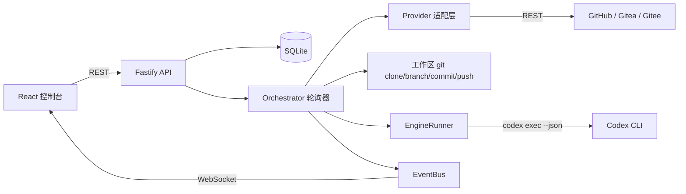

# 架构说明

## 1. 总体结构

```
autogit/
├── packages/shared/          # 标签规范、状态机、跨端类型与实时事件定义
├── apps/server/              # Fastify API、调度器、Provider 适配、Codex 执行器
│   └── src/
│       ├── db/               # SQLite 封装、迁移、DAO（Store）
│       ├── providers/        # GitHub / Gitea / Gitee 适配层
│       ├── services/         # 编排、标签、工作区、Codex、设置、事件总线
│       ├── routes/           # HTTP 接口
│       ├── dev/simulate.ts   # 端到端模拟脚本
│       └── index.ts          # 服务入口（含生产环境前端托管）
└── apps/web/                 # React 控制台
```

数据流：



## 2. 数据模型

| 表 | 用途 | 关键字段 |
| --- | --- | --- |
| `accounts` | Git 账号 | `provider`、`base_url`、`token_enc`（AES-256-GCM）、`status` |
| `repositories` | 已导入仓库 | `full_name`、`default_branch`、`clone_url`、`enabled`、`labels_initialized` |
| `issues` | Issue 快照 | `number`、`labels`(JSON)、`state`、`updated_at`（远端时间） |
| `pull_requests` | PR 快照 | `number`、`merged`、`head_ref`、`issue_number`（由分支名/正文推导） |
| `tasks` | 任务与结果 | `kind`(implement/review/fix)、`status`、`engine`、`priority`、`branch`、`pr_url` |
| `task_logs` | 逐行日志 | `task_id`、`stream`(system/stdout/stderr/agent/command/git)、`message` |
| `activity` | 操作流水 | `level`、`scope`、`repository_id`、`message` |
| `settings` | 全局设置 | JSON 值，键与 `AppSettings` 字段一一对应 |
| `schema_migrations` | 迁移版本 | 迁移在事务中执行，启动时自动补齐 |

SQLite 通过 Node 内置的 `node:sqlite`（`DatabaseSync`）访问，启用 WAL 与外键约束，所有写入都在 `Store` 内集中处理，避免 SQL 散落。

> 注意：`node:sqlite` 在打包后会被 bundler 改写成裸 `sqlite` 说明符，因此 `db/database.ts` 用 `createRequire` 动态加载它，保证 `dist/index.js` 可直接运行。

## 3. 调度器（Orchestrator）

每个轮询周期对每个启用仓库执行：

1. `listIssues(state=open)` 拉取近 200 条 Issue，筛出带 `ai/*` 标签的条目并写入 `issues` 表。
2. `listPullRequests(state=open)` 拉取 PR（含 `branchPrefix` 命中的分支），写入 `pull_requests` 表。
3. `scheduleIssues()`：`ai/todo`（或重启后残留的 `ai/doing`）→ 去重后创建 `implement` 任务。
4. `schedulePullRequests()`：`ai/needs-review` → `review` 任务；`ai/needs-fix` → `fix` 任务。
5. `reconcileMerged()`：`ai/in-review` 的 Issue 对应的 PR 若已合并 → `ai/verify`；若未合并即关闭 → `ai/stuck`。
6. `recoverStalled()`：`ai/doing` 但没有活跃任务的条目（例如进程重启）→ 重新入队。

任务执行遵守三条约束：

- **全局并发**：`maxConcurrentTasks` 控制同时运行的任务数。
- **仓库级串行**：同一仓库同时只跑一个任务，避免分支/工作区冲突。
- **优先级**：`ai/priority-high` → 0，普通 → 1，`ai/priority-low` → 2；同级按入队时间。

失败处理：任务异常 → 记录错误日志 → 在对应 Issue/PR 上打 `ai/stuck` 并留言说明如何恢复；同一目标连续失败 3 次后不再自动重试。用户主动取消的任务不会打阻塞标签。

## 4. Provider 抽象

`GitProvider` 接口把三个平台的差异收敛成 16 个方法（用户、仓库、标签、Issue、评论、PR、Git 认证头）。共同点：

- 使用 `fetch` + 统一重试（429/5xx，最多 3 次），超时 30s；
- 分页统一走 `ApiClient.paginate()`，兼容 `per_page` 与 `limit` 两种参数名；
- 标签写入统一使用「替换语义」的接口（`PUT .../labels`），避免增量操作产生的竞态；
- Git 认证头由 Provider 提供（GitHub 用 `x-access-token`、Gitea/Gitee 用 `用户名:Token` 的 Basic 认证）。

平台差异（端点、颜色格式、Gitee 的 `access_token` 查询参数、PR 标签端点兜底）见 [PROVIDERS.md](PROVIDERS.md)。

## 5. 执行引擎

`EngineRunner` 负责把一次任务变成一次 CLI 调用：

1. 读取 `CodexService.capabilities()`（5 分钟缓存）决定可用参数；
2. 拼接 `codex exec --json ... -`，提示词通过 stdin 传入（避免命令行长度与转义问题）；
3. 逐行解析 JSONL 事件，归类为 `agent` / `command` / `system` / `stderr` 并写入 `task_logs` + 实时推送；
4. 从 `--output-last-message` 文件（或最后一条 agent 消息）提取结论；
5. 评审任务附加 `--output-schema`，用 JSON Schema 强制 `{verdict, summary, issues[], tests}` 结构，解析失败则回退到文本启发式提取。

`WorkspaceManager` 负责所有 git 操作：克隆（首次）、`fetch --prune`、`checkout -B`、`reset --hard`、`clean -fd`、`commit`、`push`。提交身份、`commit.gpgsign=false`、`core.longpaths=true` 都在工作区内单独配置，不污染用户全局 git 配置。

## 6. 前端

- 路由：`/`（总览）、`/accounts`、`/repositories`、`/repositories/:id`、`/tasks`、`/codex`、`/labels`、`/settings`。
- 数据：TanStack Query 负责缓存与失效，WebSocket 事件到达时精确失效对应 query key。
- 日志：`logStore` 用 `useSyncExternalStore` 维护按任务分桶的环形缓冲（4000 行），高频日志不会引起整页重渲染。
- 设计系统：`styles.css` 中的 `panel` / `btn` / `chip` / `input` 等基础类 + Tailwind 工具类；暗色主题，动效集中在面板进场与状态切换。

## 7. 扩展点

**新增一个 Git 平台**：实现 `GitProvider`（可继承 `ApiClient` 复用重试与分页）→ 在 `providers/index.ts` 的工厂中注册 → 在 `packages/shared/src/types.ts` 的 `PROVIDER_KINDS` / `PROVIDER_META` 中补充元数据。前端会自动出现该平台选项。

**新增一个执行引擎**：在 `EngineRunner.run()` 中增加分支（参考 `runClaude`），或在 `packages/shared/src/types.ts` 扩展 `EngineId`，然后在设置页暴露启用开关。

**调整流水线**：所有状态判定都集中在 `packages/shared/src/pipeline.ts`，标签定义在 `labels.ts`。改这两个文件即可同时影响后端调度与前端展示。
