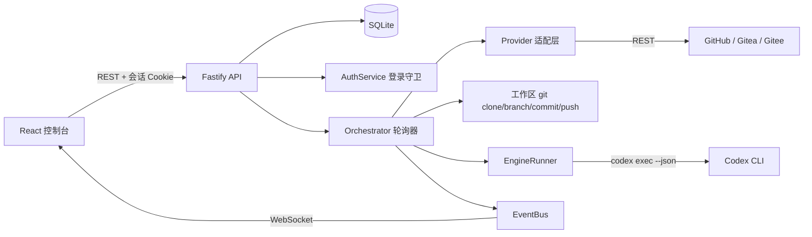
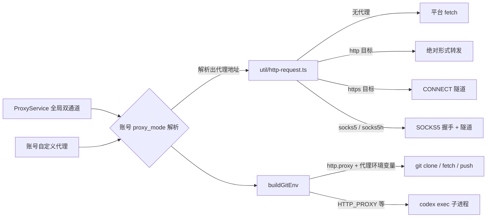
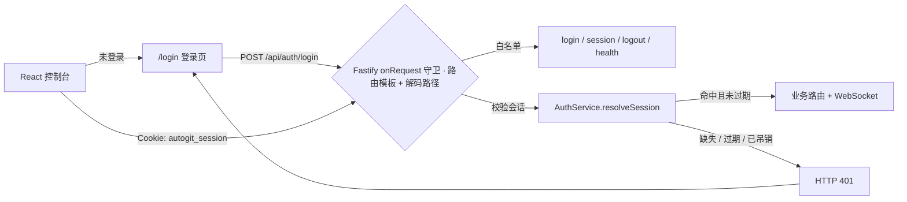

# 架构说明

## 1. 总体结构

```
autogit/
├── packages/shared/          # 标签规范、状态机、跨端类型与实时事件定义
├── apps/server/              # Fastify API、调度器、Provider 适配、Codex 执行器
│   └── src/
│       ├── db/               # SQLite 封装、迁移、DAO（Store）
│       ├── providers/        # GitHub / Gitea / Gitee 适配层
│       ├── services/         # 编排、标签、工作区、Codex、登录、设置、事件总线
│       ├── routes/           # HTTP 接口
│       ├── dev/              # 端到端模拟脚本、代理链路自检脚本
│       └── index.ts          # 服务入口（含生产环境前端托管）
└── apps/web/                 # React 控制台
```

数据流：



## 2. 数据模型

| 表 | 用途 | 关键字段 |
| --- | --- | --- |
| `accounts` | Git 账号 | `provider`、`base_url`、`token_enc`（AES-256-GCM）、`status`、`proxy_mode`、`proxy_url_enc` |
| `repositories` | 已导入仓库 | `full_name`、`default_branch`、`clone_url`、`enabled`、`labels_initialized` |
| `issues` | Issue 快照 | `number`、`labels`(JSON)、`state`、`updated_at`（远端时间） |
| `pull_requests` | PR 快照 | `number`、`merged`、`head_ref`、`issue_number`（由分支名/正文推导） |
| `tasks` | 任务与结果 | `kind`(implement/review/fix)、`status`、`engine`、`priority`、`branch`、`pr_url` |
| `task_logs` | 逐行日志 | `task_id`、`stream`(system/stdout/stderr/agent/command/git)、`message` |
| `activity` | 操作流水 | `level`、`scope`、`repository_id`、`message` |
| `settings` | 全局设置 | JSON 值，键与 `AppSettings` 字段一一对应；`proxy` 键存代理通道（地址加密） |
| `auth_account` | 登录账号 | 恒定一行（`id = 'default'`）：`username`、`password_hash`（scrypt）、`password_changed_at`（`NULL` = 仍是出厂密码）、`updated_at` |
| `auth_sessions` | 登录会话 | `token_hash`（token 的 SHA-256）、`persistent`（保持登录）、`created_at`、`last_seen_at`、`expires_at` |
| `schema_migrations` | 迁移版本 | 迁移在事务中执行，启动时自动补齐 |

SQLite 通过 Node 内置的 `node:sqlite`（`DatabaseSync`）访问，启用 WAL 与外键约束，所有写入都在 `Store` 内集中处理，避免 SQL 散落。

> 注意：`node:sqlite` 在打包后会被 bundler 改写成裸 `sqlite` 说明符，因此 `db/database.ts` 用 `createRequire` 动态加载它，保证 `dist/index.js` 可直接运行。

## 3. 调度器（Orchestrator）

每个轮询周期对每个启用仓库执行：

1. `listIssues(state=open)` 拉取近 200 条 Issue，筛出带 `ai/*` 标签的条目并写入 `issues` 表。
2. `listPullRequests(state=open)` 拉取 PR（含 `branchPrefix` 命中的分支），写入 `pull_requests` 表。
3. `scheduleIssues()`：`ai/todo`（或重启后残留的 `ai/doing`）→ 去重后创建 `implement` 任务。
4. `schedulePullRequests()`：`ai/needs-review` → `review` 任务；`ai/needs-fix` → `fix` 任务。
5. `reconcileClosedItems()`：轮询只看 `state=open`，被关闭/合并的条目会从远端列表里消失 —— 逐个复查这些缺失条目（每条一次 `getIssue`/`getPullRequest`，单轮上限 10 次），把本地快照标记为 `closed`，使看板、计数与调度只呈现 open 的 Issue/PR。
6. `reconcileMerged()`：`ai/in-review` 的 Issue 对应的 PR 若已合并 → `ai/verify`；若未合并即关闭 → `ai/stuck`。
7. `recoverStalled()`：`ai/doing` 但没有活跃任务的条目（例如进程重启）→ 重新入队。

关闭的条目不会被删除：`issues` / `pull_requests` 表保留快照供任务历史与标签回溯使用，`Store.listOpenIssues()` / `listOpenPullRequests()` 是「只认 open」的唯一读取口径，仓库工作台看板、仓库列表计数与 `countTrackedItems()` 都走它。

任务执行遵守三条约束：

- **全局并发**：`maxConcurrentTasks` 控制同时运行的任务数。
- **单仓库并发**：`maxConcurrentPerRepo` 控制同一仓库同时运行的任务数（默认 1）。每个任务在 `workspaces/tasks/<repositoryId>/<taskId>` 下有独立克隆，所以同一仓库的并发任务不会共享分支或工作区。
- **优先级**：`ai/priority-high` → 0，普通 → 1，`ai/priority-low` → 2；同级按入队时间。

失败处理：任务异常 → 记录错误日志 → 在对应 Issue/PR 上打 `ai/stuck` 并留言说明如何恢复；同一目标连续失败 3 次后不再自动重试。重试额度以最近一次 `ai/stuck` 为基线（`issues.stuck_at` / `pull_requests.stuck_at`，迁移 `003_stuck_baseline`），人工移除该标签后的重试会重新获得完整额度——否则计数终身累计，人一旦重试就会被立刻再次阻塞。用户主动取消的任务不会打阻塞标签。

进程重启时，数据库里残留的 `queued` / `running` 任务会先被记为 `cancelled`（不算失败，不消耗 3 次额度）：它们在内存队列里的位置和 AbortController 已随进程消失，继续留在库里会让 `hasOpenTask()` 永久认为该 Issue/PR 忙碌。释放后的条目由下一次轮询按其远端标签重新入队，它们遗留的任务工作区也在同一步删除。

去重按任务类型取字段：`implement` 比对 Issue 号，`review` / `fix` 比对 PR 号。评审任务同时记录关联 Issue 号，用它做去重会让「PR #5 关联 Issue #3」这类条目每个轮询周期都重新入队一次。

只有**没有 worker 的**任务行会被释放：`reconcileInterruptedTasks()` 先排除本进程仍在内存队列或正在运行的任务。`POST /api/orchestrator/restart`（设置页的「重启调度器」，用于让改动立即生效）改走 `Orchestrator.restart()`，队列与运行中的任务都保留 —— 否则仍在排队、随后照常执行的任务会先被标成 `cancelled`，并留下一条“服务重启中断”的活动记录。

失败落 `ai/stuck` 时，`markStuck()` 除了写远端标签，还会把标签回写进本地快照（`Store.setItemLabels()`）并重新推送任务状态：重试门禁（`GET /api/tasks` 的 `retryable`）与看板读的就是本地快照，回写后按钮立即可用，不必等下一轮轮询（默认 45s）。每次失败只发放一次重试：`POST /api/tasks/:id/retry` 会消费掉 `ai/stuck`。

PR 正文由 `buildPullRequestBody()` 生成，按仓库约定固定包含 `## 实现假设清单` 与 `## 代码逻辑图` 两节：实现任务的提示词要求模型在总结里给出这两节，AutoGit 抽取后放进 PR 正文；模型没给时回落到「无额外假设」与 AutoGit 流水线示意图，保证两节始终非空。这两节不会进入提交信息。

## 4. Provider 抽象

`GitProvider` 接口把三个平台的差异收敛成 16 个方法（用户、仓库、标签、Issue、评论、PR、Git 认证头）。共同点：

- 使用 `fetch` + 统一重试（429/5xx，最多 3 次），超时 30s；
- 未配置代理时走平台 `fetch`；配置了代理则改走 `util/proxy-http.ts` 的代理客户端（HTTP 绝对形式 / CONNECT 隧道 / SOCKS5），行为与重试策略一致；
- 分页统一走 `ApiClient.paginate()`，兼容 `per_page` 与 `limit` 两种参数名；
- 标签写入统一使用「替换语义」的接口（`PUT .../labels`），避免增量操作产生的竞态；
- Git 认证头由 Provider 提供（GitHub 用 `x-access-token`、Gitea/Gitee 用 `用户名:Token` 的 Basic 认证）。

平台差异（端点、颜色格式、Gitee 的 `access_token` 查询参数、PR 标签端点兜底）见 [PROVIDERS.md](PROVIDERS.md)。

## 5. 执行引擎

`EngineRunner` 负责把一次任务变成一次 CLI 调用：

1. 读取 `CodexService.capabilities()`（5 分钟缓存）决定可用参数；
2. 拼接 `codex exec --json ... -`，提示词通过 stdin 传入（避免命令行长度与转义问题）；
3. 逐行解析 JSONL 事件，归类为 `agent` / `command` / `system` / `stderr` 并写入 `task_logs` + 实时推送；
4. 从 `--output-last-message` 文件（或最后一条 agent 消息）提取结论；
5. 评审任务附加 `--output-schema`，用 JSON Schema 强制 `{verdict, summary, issues[], tests}` 结构；
6. 结论解析先做 JSON 提取、再做 `VERDICT:` 文本启发式（容忍 `approve` / `needs-fix` / 中文“通过”等写法）；仍然解析不出结论时，把模型上一次的输出回灌给它，要求只重新序列化结论（最多 2 次），全部失败才判定评审任务失败。

`WorkspaceManager` 负责所有 git 操作：克隆（首次）、`fetch --prune`、`checkout -B`、`reset --hard`、`clean -fd`、`commit`、`push`。提交身份、`commit.gpgsign=false`、`core.longpaths=true` 都在工作区内单独配置，不污染用户全局 git 配置。

布局是「每仓库一个只读基座克隆 + 每任务一个一次性克隆」：`workspaces/<repositoryId>` 只做 clone / fetch，供任务克隆复用对象库（`git clone --local` 硬链接，不产生第二次下载）；真正跑任务的是 `workspaces/tasks/<repositoryId>/<taskId>`，任务结束后删除，进程重启时清理遗留目录。这样同一仓库的并发任务各自持有独立的分支与工作树。基座克隆是共享状态，所以它的 clone / fetch 按 repositoryId 串行（`util/keyed-lock.ts`）：否则同一仓库的两个任务会同时更新同一个 `refs/remotes/origin/*`，后手以 `cannot lock ref … is at X but expected Y` 失败并拖垮整个任务。

工作区是可丢弃的克隆，切换分支前先把它恢复成干净状态：常规路径 `clean -fd` + `reset --hard` 丢掉上一次运行留下的改动与未跟踪文件；失败或 `checkout` 仍然被挡时升级为强制清理 —— `clean -fdx`、回滚未完成的 merge/rebase/cherry-pick、删除残留的 `.git/*.lock` —— 再重试一次 `checkout --force`。克隆与 `fetch` 遇到网络类错误（连接重置、超时、5xx）或 ref 抢锁（`cannot lock ref` / `unable to update local ref`，重试时会重新读取引用）会退避重试 2 次，认证与权限错误依旧立即失败。

`CodexService.modelProbe()` 是唯一的可用性判据：用固定提示词执行一次最小的 `codex exec`（只读沙箱、`--ephemeral`，跑在 AutoGit 数据目录里），按退出码与输出判断模型能否响应，结果缓存 5 分钟。同一时刻只跑一次探测，并在进行中时报告 `probing`：`POST /api/codex/invalidate`（「重新检测」）只清缓存、把探测放到后台，避免请求最长阻塞 3 分钟，`POST /api/codex/probe`（「测试模型响应」）才会等待结果；两个入口都会在探测结束后写入活动记录。AutoGit 不读取 `auth.json`，也不判断登录态 —— 凭证与授权全由 Codex CLI 自己管理。

## 6. 前端

- 路由：`/login`（登录，未登录时唯一可见的页面）、`/`（总览）、`/accounts`、`/repositories`、`/repositories/:id`、`/tasks`、`/codex`、`/proxy`、`/labels`、`/settings`；除 `/login` 外全部包在 `RequireAuth` 内。
- 数据：TanStack Query 负责缓存与失效，WebSocket 事件到达时精确失效对应 query key。
- 日志：`logStore` 用 `useSyncExternalStore` 维护按任务分桶的环形缓冲（4000 行），高频日志不会引起整页重渲染。
- 任务记录：`VirtualList` 按固定行高（88px）做窗口化渲染，`/tasks` 与仓库工作台的任务列表是固定高度的虚拟列表，只挂载可视区内的行；总览里 8 条以内的预览列表仍按普通列表渲染。
- 设计系统：`styles.css` 中的 `panel` / `btn` / `chip` / `input` 等基础类 + Tailwind 工具类；暗色主题，动效集中在面板进场与状态切换。
- 主题：偏好（跟随系统 / 浅色 / 深色）由 `lib/theme.ts` + `hooks/useTheme.tsx` 维护并写入 `localStorage`，默认跟随系统；`index.html` 的前置脚本在首帧前写好 `<html data-theme>`，避免闪屏。样式以暗色为基线，`styles.css` 的 `[data-theme='light']` 重定向 `white` / `slate` / `*-200~400` 等基础色板，组件无需为两套主题各写一份类名。

## 7. 代理链路

网络出口在 AutoGit 里是一条独立链路，目标是「不依赖任何第三方代理库，也能让 git 与 REST 请求走同一个出口」。



- **双通道**：`http` 是合并后的 HTTP(S) 通道——明文 http 目标用绝对形式转发，https 目标用它做 `CONNECT` 隧道；`socks5` 同样覆盖两种目标，`socks5h://` 表示由代理解析域名。通道地址接受 `http://`、`https://`、`socks5://`、`socks5h://`，允许内嵌 `用户名:密码`（`https://` 表示到代理本身也走 TLS）。
- **解析顺序**：账号 `proxy_mode` 决定通道（`inherit` 跟随全局默认，`http`/`socks5` 固定走某个通道，`direct` 强制直连，`custom` 用账号自己的地址）。所选通道为空时回退到另一个（`http → socks5`，`socks5 → http`），因此只填一个地址就能让全部流量走代理。总开关关闭时一律直连，并清掉继承来的代理环境变量。旧版本的 `auto` / `https` 模式在读取时映射到 `http`，旧的 `endpoints.https` 地址合并进 HTTP(S) 通道（优先采用，因为它已验证过 CONNECT）。
- **git**：通过 `GIT_CONFIG_*` 注入 `http.proxy`，同时写入 `HTTP_PROXY/HTTPS_PROXY/ALL_PROXY` 及小写变体；因为代理地址可能带凭据，注入时会追加一条空的 `credential.helper`，避免 Git Credential Manager 去探测代理主机（实测会挂起数分钟）。
- **Codex CLI**：配置了代理的账号会把代理变量传给 `codex exec`，让模型请求也走同一出口；没配置代理时不改动继承的环境变量。
- **连通性测试**：`POST /api/proxy/test` 对「直连 + 各通道」或单个账号并发执行两项检查——`GET github api`（跟随重定向、解压 gzip、超时可控）与真实 `git ls-remote`，结果按检查项返回状态码、耗时与可读错误；测试支持使用未保存的草稿地址。
- **自检脚本**：`pnpm --filter @autogit/server proxy:check` 会在本机起「源站 + HTTP 代理 + 需认证的 HTTP 代理 + SOCKS5（含账号密码）」，覆盖绝对形式、CONNECT 隧道、认证失败、重定向、gzip、错误码映射等断言；加 `-- --online` 还会用真实 `https://api.github.com/` 验证 TLS 隧道。

## 8. 登录门禁

AutoGit 是单用户本地工具，所以没有用户表：`auth_account` 恒定只有一行，首次启动写入出厂凭据 `admin` / `admin`（启动日志会提醒尽快修改）。



- **守卫**：`routes/index.ts` 在 `registerRoutes()` 内注册 `onRequest` 钩子，判断依据是**路由器匹配到的路由模板**（`request.routeOptions.url`）：`/api` 下除 `login` / `session` / `logout` / `health` 外一律要求有效会话，否则直接 `401`。路由器匹配的是百分号解码后的路径，所以 `/%61pi/system/overview` 与 `/api/system/overview` 命中同一条路由、也走同一道门禁 —— 早期版本按原始 `request.url` 做字符串比较，编码写法能整条绕开白名单（实测未登录即可读写全部接口与实时通道）。没匹配到路由的请求只会落到 404 / SPA 兜底，这里再按解码后的路径复查一遍，因此编码的 `/api` 前缀既跑不到处理器，也选不中公开白名单。`health` 是唯一为「没有会话的调用方」保留的业务接口：systemd / 容器 healthcheck / 外部监控都拿不到 Cookie，变成 `401` 等于升级后探活静默失败，而它只回 `ok`、`uptimeSeconds`、`version` 与 Node 版本。`/api/realtime` 的 WebSocket 升级请求走同一钩子，所以未登录连不上实时通道；静态资源（SPA 的 HTML/JS）保持公开，前端才有机会跳转到 `/login`。**没有任何方法级豁免**：`OPTIONS` 与其它方法一样要求会话 —— 早期版本对 `OPTIONS` 直接放行，等于给将来注册的 OPTIONS 路由留了一扇免登录的门，而 AutoGit 同源托管前端、不注册 CORS，本来就没有需要应答的预检。
- **跨源**：不注册 `@fastify/cors` —— 开发模式前端经 Vite 同源代理访问 `/api`，生产模式由同一个后端托管前端，都不需要 CORS；而 `origin: true` 会把任意网站的 `Origin` 原样回填并允许携带凭证，等于让任意网站在受害者浏览器里读写本机接口。现在跨源请求拿不到任何 `Access-Control-*` 头，加上 Cookie 是 `HttpOnly; SameSite=Lax`，跨站子请求既带不上凭证也读不到响应。实时通道的升级请求（`101` 响应，既没有可读的响应体也没有 CORS 层兜底）再补一道服务端自己的校验：`util/origin.ts` 比较 `Origin` 与握手到达的 `Host`，不一致直接 `403`，不再把安全完全交给「浏览器会不会带上 Lax Cookie」这一实现细节；后者的比较范围是主机与端口，不含协议 —— TLS 通常终结在反向代理上，进程看到的协议是 `http`，把协议拉进这条比较会锁住所有 HTTPS 部署；没带 `Origin` 的非浏览器客户端（`curl`、探针、脚本）照旧放行，而 `Origin` 由浏览器设置、页面脚本改不了。生产模式只接受同源与 `AUTOGIT_ALLOWED_ORIGINS` 列出的来源，且 `pnpm start` / `node dist/index.js` 在没有 `NODE_ENV` 时会由 `config.ts:applyDefaultNodeEnv()` 默认成 `production`（npm 脚本无法跨平台导出该变量，旧实现因此让 README 记载的生产启动悄悄退回开发策略）；开发模式额外接受 `AUTOGIT_DEV_ORIGINS`（默认 `http://localhost:5173`、`http://127.0.0.1:5173`，可覆盖）—— Vite 代理用 `changeOrigin: true`，后端看到的是 `Origin: http://localhost:5173` + `Host: 127.0.0.1:4711`，不放行就等于开发环境连不上自己的实时通道。放行范围只到开发服务器自己的来源为止：`127.0.0.1` 上的其它端口对本机页面属于同站，Lax Cookie 会随握手发出，早期「任意回环来源都放行」等于把这些页面也放进实时通道。写请求（非 `GET`/`HEAD`/`OPTIONS`）走的就是同一道校验，而且排在公开白名单之前：`POST /api/orchestrator/tick`、`POST /api/orchestrator/restart`、`POST /api/codex/invalidate` 这类请求没有请求体、属浏览器眼里的简单请求，**不触发预检**，同站另一个端口照样能触发轮询、重启与重新探测（读响应被 CORS 挡住，动作却已经发生），公开接口里也只有 `POST /api/auth/login` 是状态变更 —— 跨站页面若能触发它就能把浏览器登录到攻击者掌握的账号上，一并拦下。会话校验仍是先手（未登录的跨站写请求返回 `401` 而不是 `403`，不泄露「这个来源可不可信」）。两个白名单（`AUTOGIT_ALLOWED_ORIGINS` / `AUTOGIT_DEV_ORIGINS`）的条目按完整 origin（协议 + 主机 + 端口，统一小写）比较：条目里写了协议就锁定协议，列 `https://autogit.example.com` 不会再顺带放行同主机的 `http://autogit.example.com`（早期只比 authority，README 的「只接受同源与显式列出的来源」因此偏松）；只写主机名的条目依旧只比主机，README 与 `.env.example` 建议始终写全协议。
- **凭据**：密码用 scrypt（`N=16384, r=8, p=1`，随机盐）哈希后入库，校验走 `timingSafeEqual`；接口只返回用户名、「是否仍是默认密码」与活跃会话数，从不返回哈希或明文。每次登录恒定只跑一次 scrypt：用户名对不上时校验的是启动时就生成好的诱饵哈希，所以「用户名不存在」不会比「密码错误」更快（早期版本在用户名不匹配时短路，约 0ms vs 约 25ms，等于一个用户名探测器）。连续失败 5 次后进入退避窗口：窗口内直接 `429` +「请 N 秒后重试」，每次再失败窗口翻倍（1 秒 → 最长 30 秒），窗口自然过期，成功登录清零 —— 目的是把在线猜解从「scrypt 允许的最快速度」压到每秒一次量级，同时不给单用户工具留下永久锁死自己的开关。计数器是 `AuthService` 的内存态（重启即清零），且因为这个工具只有一个账号、按实例计数而不是按来源 IP 计数，换用户名重试同样躲不开。
- **会话**：`login()` 用 `randomBytes(32)` 生成 token，库里只存 `sha256(token)`；Cookie 为 `HttpOnly; SameSite=Lax`（HTTPS 部署下再加 `Secure`，是否采信代理的 `X-Forwarded-Proto` 由 `AUTOGIT_TRUST_PROXY` 决定，见下一条）。勾选「保持登录」时是 30 天滚动窗口：解析会话按 5 分钟节流把 `expires_at` 往后推，并在同一次响应里（`onSend` 钩子）补一个 `Set-Cookie` 把新的 `Max-Age` 交给浏览器 —— 只续库不续 Cookie 的话，浏览器仍会在登录后第 30 天删掉它，天天使用也会被强制重新登录。不勾选则是浏览器会话 Cookie，`expires_at` 固定在登录后 12 小时、不随访问顺延。过期的会话在解析与登录时顺手清理。实时连接是这条规则的一个例外：WebSocket 升级响应带不了 `Set-Cookie`，所以 `lib/realtime.ts` 在连接存活期间每 12 小时发一次 `GET /api/auth/session`（同一窗口内的重连按 5 分钟节流），让浏览器侧的 Cookie 跟着服务端一起顺延；该请求若返回 `401`，或服务端用 `4401` 关闭已建立的连接（其他设备改凭据、退出登录、会话过期），都说明会话已经失效：客户端广播一次 `autogit:unauthorized` 并停止重连，标签页随即回到登录页。本机改凭据是这条规则的反例：服务端改发 `4402`，客户端只重连（新 Cookie 就在同一个 `PUT` 的响应里），登录态不动。
- **接口**：`POST /api/auth/login` 登录、`GET /api/auth/session` 查询状态、`POST /api/auth/logout` 吊销并清 Cookie、`PUT /api/auth/credentials` 修改账号/密码（必须提供当前密码）。
- **反向代理**：TLS 终结在反向代理、以明文 HTTP 转发给本进程时 `request.protocol` 默认只能是 `http`，会话 Cookie 因此不带 `Secure`（直连 `127.0.0.1` 的默认用法不受影响）。给进程设 `AUTOGIT_TRUST_PROXY`（`1` / `true` / `yes` / `on`，或只信任代理地址的 `127.0.0.1,::1`）后，`app.ts` 把它交给 `Fastify({ trustProxy })`，Fastify 才会采信 `X-Forwarded-Proto`；`util/http.ts:isSecureRequest()` 随即在登录、滚动续期（`onSend` 钩子）与退出登录清除三处给 Cookie 加 `Secure`。开关关闭时该请求头一律忽略：能直连端口的客户端无法用它决定 Cookie 属性。
- **前端会话失效**：`lib/realtime.ts` 的 `onclose` 会读关闭码 —— 服务端在其他设备改凭据 / 退出登录 / 会话过期时用 `4401` 关闭已建立的连接（`routes/system.ts`），此时 Cookie 已经失效，按退避重连只会一直 `401`，所以客户端广播一次 `autogit:unauthorized` 并停止重连；发起改凭据的那个浏览器收到的是 `4402`，它的 Cookie 由同一次 `PUT` 的响应换新，所以只退避重连、不广播失效；其它关闭码保持原有退避重连。`lib/api.ts` 只在受保护路由的 `401` 上广播（豁免名单精确到 `login` / `session` / `logout` 三条公开路由），因此 `PUT /api/auth/credentials` 的 `401` 同样把标签页送回登录页，而密码错误留在表单上的 `401` 不会误伤。
- **改密码后轮换**：修改成功会删除全部旧会话并签发新会话，其他设备立即掉线，发起修改的浏览器拿新 Cookie 继续使用。删除会话会通过 `AuthService.onSessionRevoked()` 广播一次「会话已吊销」（改凭据 = 全部会话并带上 `rotatedFrom`，退出登录 = 当前会话），`/api/realtime` 里已经建立的连接据此关闭 —— 标记为发起方的连接收到 `4402`（用新 Cookie 重连），其余收到 `4401`（登出）；此外每个连接每 30 秒用自己的 Cookie 复查一次会话，覆盖过期与清理这类没有广播的失效。
- **默认凭据提示**：`auth_account.password_changed_at` 记录密码是否被改过（`NULL` = 仍是出厂密码），`GET /api/auth/session` 因此不再对默认账号跑一次约 25ms 的同步 scrypt；旧库没有这一列时，首次启动会用一次校验结果回填。判定只看这一列、不再看用户名：先改名再改密码是最常见的顺序，早期版本要求用户名仍是 `admin`，用户一改名弱口令提示就消失了，而出厂口令其实还在。这一列跟着「当前口令是不是出厂口令」走：只改用户名不写这一列，而 `PUT /api/auth/credentials` 把密码设回 `admin` 时会清空它（`upsertAuthAccount` 的 `passwordChanged` 是三态：省略=保持、`true`=打时间戳、`false`=清空），所以显式改回弱口令后提示会重新出现。设置密码时用一次明文常量比较（NFKC 归一化后等于 `admin`）判断，不需要额外 scrypt。
- **前端**：`lib/auth.tsx` 把会话缓存在 React Query（key `auth-session`），`AuthProvider` 挂在 `App.tsx` 的 `Routes` 外层（因此仍在 `QueryClientProvider` 与 `BrowserRouter` 内，且与 `main.tsx` 的主题包裹层互不干扰）；`App.tsx` 的 `RequireAuth` 在会话未知时显示占位、未登录时跳转 `/login` 并记住原路径，登录后跳回。受保护接口返回 `401` 时 `lib/api.ts` 广播 `autogit:unauthorized`，上下文清空会话并关闭 WebSocket，路由随即回到登录页。改凭据请求失败时（此时旧会话可能已经被轮换掉）`updateCredentials` 会 `invalidateQueries` 重新确认一次会话，而不是继续信任缓存里的「已登录」。
- **自检**：`pnpm --filter @autogit/server auth:check`（`src/dev/auth-check.ts`）在临时数据目录里启动真实 HTTP 栈并断言 43 项行为：未登录 401（含不带会话的 `OPTIONS` 与预检样式请求）、探活接口 `GET /api/health`（含编码写法）未登录可访问且只回 `ok` / `uptimeSeconds` / `version` / `node`、百分号编码路径（`/%61pi/...`，含写操作、`OPTIONS` 与实时通道）同样 401、默认账号登录、未知用户名与错误密码不可区分（响应时间下界 + 相同文案）、保持登录 Cookie 与滚动续期（Cookie 同步续期，并按前移幅度核对库内 `expires_at`）、非保持登录的 12 小时上限、跨源请求无 CORS 头、写请求的来源校验（跨站与同站其它端口的 `POST /api/orchestrator/tick`、`POST /api/orchestrator/restart`、`POST /api/codex/invalidate` 与跨站 `POST /api/auth/login` 全部 403、未登录的跨站写请求 401、同源 / Vite 开发来源 / 无 `Origin` 的写请求 200）、会话摘要不做 scrypt、过期会话清理、改账号密码与会话轮换、只改用户名时 `defaultCredentials` 仍为 `true`、把密码显式改回 `admin` 后 `defaultCredentials` 恢复为 `true` 且 `password_changed_at` 被清空、退出登录、连续失败 5 次后的 `429` 限速与窗口过期后的自动恢复、`applyDefaultNodeEnv()` 让编译产物默认进入生产模式（显式 `NODE_ENV` 优先）、`AUTOGIT_DEV_ORIGINS` 只在开发模式生效、`AUTOGIT_TRUST_PROXY` 的解析（默认关闭、开 / 关写法、地址列表）与反向代理下的 `Secure` Cookie（登录、续期、清除三处都带；代理报告明文时不带；开关关闭时请求头被忽略）、在真实监听端口上用原始握手验证 WebSocket 升级（未登录 401、跨站 `Origin` 403、同源与 Vite 开发来源 101、其它本地端口与生产实例的开发来源 403、生产实例仅放行 `AUTOGIT_ALLOWED_ORIGINS` 列出的来源、白名单与开发来源的协议必须一致（`https://` 条目不放行 `http://` 来源，`http://` 开发来源不放行 `https://` 来源）、只写主机名的条目仍按主机比对、改凭据时发起方收到 `4402` 而其他设备与退出登录后的连接被 `4401` 关闭），以及旧库（缺 `password_changed_at` 列）升级时的回填。

前端另有 `pnpm --filter @autogit/web client:check`（`apps/web/src/dev/client-check.ts`）：用 `window` / `WebSocket` / `fetch` 桩件断言 7 项 —— `4401` 关闭时广播 `autogit:unauthorized` 并停止重连、`4402`（本机轮换）关闭时不广播且立即重连、其它关闭码先按 5 分钟节流核对一次会话（失效同样广播）再退避重连、会话仍有效时不广播、受保护接口（含 `PUT /api/auth/credentials`）的 `401` 广播失效、公开登录接口的 `401` 与 `403` 等其它状态码不广播。

## 9. 扩展点

**新增一个 Git 平台**：实现 `GitProvider`（可继承 `ApiClient` 复用重试与分页）→ 在 `providers/index.ts` 的工厂中注册 → 在 `packages/shared/src/types.ts` 的 `PROVIDER_KINDS` / `PROVIDER_META` 中补充元数据。前端会自动出现该平台选项。

**新增一个执行引擎**：在 `EngineRunner.run()` 中增加分支（参考 `runClaude`），或在 `packages/shared/src/types.ts` 扩展 `EngineId`，然后在设置页暴露启用开关。

**调整流水线**：所有状态判定都集中在 `packages/shared/src/pipeline.ts`，标签定义在 `labels.ts`。改这两个文件即可同时影响后端调度与前端展示。
